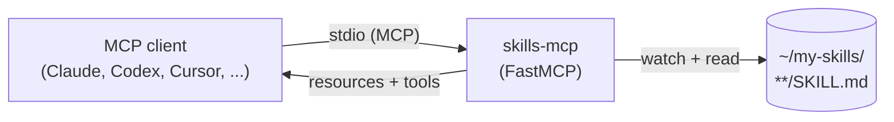

# skills-mcp

> Your scattered AI skills, one MCP server. Point it at a folder, get tools every MCP client (Claude Code, Claude Desktop, Codex, Cursor, Cline, …) can call. Run `skills-mcp gather` and it pulls every skill from `~/.claude/skills`, `~/.factory/skills`, `~/.cursor/skills`, … into one place — then optionally deletes the originals so they stop auto-loading into context. Run `skills-mcp add` to install skills from any git repo or local path.

[](https://github.com/anand-92/skills-mcp/actions/workflows/ci.yml)
[](https://www.python.org/downloads/)
[](LICENSE)
[](https://modelcontextprotocol.io)
[](https://github.com/jlowin/fastmcp)

`skills-mcp` is a tiny [FastMCP](https://github.com/jlowin/fastmcp) server. Drop `SKILL.md` files into a folder and every skill becomes an MCP resource that any MCP client can list and read. A single `show_skills` tool lets the model discover what's available without bloating the system prompt. The bundled `skills-mcp gather` CLI consolidates skills you've already accumulated across half a dozen AI tools so they live in exactly one place. No registry, no plugin system, just a folder.

---

## Why

Every AI tool now ships its own skills folder. You end up with:

```
~/.claude/skills/code-review/SKILL.md
~/.factory/skills/code-review/SKILL.md
~/.codex/skills/code-review/SKILL.md
~/.cursor/skills/sql-review/SKILL.md
```

Each one **auto-loads into that tool's context window at startup** — even when you don't need it. And the same skill drifts out of sync across tools. `skills-mcp`:

1. **Consolidates** them with `skills-mcp gather` — copies every skill into one root, dedupes identical content silently, flags real conflicts.
2. **Serves** them over MCP — so they load *on demand* when the model invokes the tool, not at every startup.
3. **Lets you delete the originals** — freeing the context the AI tools were spending on skills you weren't using.

---

## What it does



## Install

Requires **Python 3.10+**.

### With [uv](https://github.com/astral-sh/uv) (recommended)

```bash
uv tool install git+https://github.com/anand-92/skills-mcp
```

> **After install:** `uv tool install` places `skills-mcp` in `~/.local/bin`. If you get "command not found", open a new terminal or run `rehash` to refresh your shell's command cache. Verify with `which skills-mcp`.

### From source

```bash
git clone https://github.com/anand-92/skills-mcp
cd skills-mcp
uv sync          # or: pip install -e .
```

## Quick start

```bash
skills-mcp gather --dry-run     # see the plan
skills-mcp gather               # copy into ~/my-skills, then asks about deleting originals
SKILLS_ROOT=~/my-skills skills-mcp list   # verify discovery
SKILLS_ROOT=~/my-skills skills-mcp        # serve
```

The server speaks MCP over stdio, so it is normally launched by your MCP client (see snippets below) rather than by hand. Use `skills-mcp list` whenever you want to debug what is being discovered without booting the full server.

## `skills-mcp gather` — consolidate skills you already have

Most people end up with skills duplicated across a handful of tools:

```
~/.claude/skills/code-review/SKILL.md     (auto-loads into Claude Code's context)
~/.factory/skills/code-review/SKILL.md    (auto-loads into Factory's context)
~/.codex/skills/code-review/SKILL.md      (auto-loads into Codex's context)
~/.cursor/skills/sql-review/SKILL.md      (auto-loads into Cursor's context)
```

`skills-mcp gather` scans every known AI-tool dot-folder under `$HOME` *and* the current directory, copies every skill into one destination, dedupes by content, and asks if you want to delete the originals so they stop auto-loading.

```text
$ skills-mcp gather
Sources scanned:
  ~/.claude/skills                (/Users/you/.claude/skills)
  ~/.factory/skills               (/Users/you/.factory/skills)
  ~/.codex/skills                 (/Users/you/.codex/skills)
  ~/.cursor/skills                (/Users/you/.cursor/skills)

Destination: /Users/you/my-skills (will create)

Found 18 skill(s) to write; 2 slug conflict(s), 5 dupe(s) skipped.

  [+] code-review              ← ~/.claude/skills/code-review   (kept first; skipped 2 other version(s))
  [+] commit-msg               ← ~/.claude/skills/commit-msg
  [+] sql-review               ← ~/.cursor/skills/sql-review
  ...

Conflicts (different content for the same slug):
  • code-review  → skip
      ~/.claude/skills/code-review
      ~/.factory/skills/code-review

Proceed with copy? [Y/n]: y
✓ Wrote 18 skill folder(s) to /Users/you/my-skills.

The source folders below can be removed so they no longer auto-load into your AI
tools and consume context at startup. They've already been copied to the destination.
  - ~/.claude/skills/code-review
  - ~/.claude/skills/commit-msg
  - ...

Delete source folders? [y/N]: y
✓ Removed 18 source skill folder(s).

────────────────────────────────────────────────────────
  Your skills are consolidated. Wire them up in one step:
────────────────────────────────────────────────────────

  Claude Code:
    claude mcp add skills -- skills-mcp

  Claude Desktop / Cursor / VS Code (mcp.json):
    {
      "mcpServers": {
        "skills": {
          "command": "skills-mcp",
          "env": { "SKILLS_ROOT": "/Users/you/my-skills" }
        }
      }
    }

  Codex (~/.codex/config.toml):
    [mcp_servers.skills]
    command = "skills-mcp"
    env = { SKILLS_ROOT = "/Users/you/my-skills" }
────────────────────────────────────────────────────────
```

Useful flags:

| Flag | What it does |
| --- | --- |
| `--dry-run` | Show the plan and exit. Writes nothing, deletes nothing. |
| `--dest PATH` | Destination directory (default: `~/my-skills`). |
| `--source PATH` | Add an extra source directory. Repeatable. |
| `--on-conflict skip\|newest\|rename` | What to do when two skills have the same slug but different content. Default: `skip` (keep first). |
| `--symlink` | Symlink each skill folder instead of copying. |
| `--force` | Overwrite existing destination skill folders. |
| `--yes` / `-y` | Skip the proceed prompt for copying. Does **not** auto-delete sources. |
| `--delete-sources` | Delete originals after copying without prompting. |
| `--keep-sources` | Never prompt to delete sources. |

Sources scanned by default (under both `$HOME` and `.`): `.claude`, `.claude-code`, `.factory`, `.codex`, `.cursor`, `.junie`, `.aider`, `.continue`, `.windsurf`, `.codeium`, `.zed`, `.agent`, `.agents`, `.anthropic`, `.openai`, `.cline`, `.roo`, `.roocode` (each looked up under `.../skills/`).

## `skills-mcp add` — install skills from a git repo or local path

Found a repo full of skills on GitHub? Or a teammate shared a local folder? `skills-mcp add` clones (or uses a local path), discovers every `SKILL.md` inside it, and copies the skills into your destination folder (default: `~/my-skills`).

```bash
# GitHub shorthand
skills-mcp add anand-92/skills-mcp

# Full git URL
skills-mcp add https://github.com/owner/repo.git

# Local directory
skills-mcp add ./my-local-skills

# List what a repo contains without installing
skills-mcp add owner/repo --list

# Install only specific skills
skills-mcp add owner/repo --skill code-review --skill sql-review

# Custom destination
skills-mcp add owner/repo --dest ~/work-skills

# Overwrite existing and skip the confirmation prompt
skills-mcp add owner/repo --force --yes
```

Useful flags:

| Flag | What it does |
| --- | --- |
| `--dest PATH` | Destination directory (default: `~/my-skills`). |
| `--skill NAME` | Install only a specific skill by slug or name. Repeatable. |
| `--list` / `-l` | List available skills in the source without installing. |
| `--force` / `-f` | Overwrite existing destination skill folders. |
| `--yes` / `-y` | Skip the confirmation prompt before installing. |
| `--main-file NAME` | Marker filename for a skill folder (default: `SKILL.md`). |

## Configuration

Every option is an environment variable. All are optional.

| Variable | Default | Description |
| --- | --- | --- |
| `SKILLS_ROOT` | `~/my-skills` | One or more directories to scan. Separate multiple paths with the OS path separator (`:` on macOS/Linux, `;` on Windows). The server fails fast if any path is missing. |
| `SKILLS_MAIN_FILE_NAME` | `SKILL.md` | Filename that marks a skill folder. Every folder containing this file (at any depth under a root) becomes a skill. |
| `SKILLS_SERVER_NAME` | `skills` | Name advertised to MCP clients. |
| `SKILLS_RELOAD` | `false` | Re-scan skills on every request so edits take effect immediately. Useful during development; adds overhead, so leave off in production. |
| `SKILLS_LOG_LEVEL` | `INFO` | Server log level (`DEBUG`, `INFO`, `WARNING`, `ERROR`, `CRITICAL`). |

See [`.env.example`](.env.example) for a copy-pasteable template.

### Multi-root example

```bash
SKILLS_ROOT="$HOME/my-skills:$HOME/work/team-skills" skills-mcp
```

## Connecting from MCP clients

### Claude Code

```bash
claude mcp add skills -- skills-mcp
```

Or, equivalently, in `~/.claude/mcp.json`:

```json
{
  "mcpServers": {
    "skills": {
      "command": "skills-mcp",
      "env": { "SKILLS_ROOT": "/Users/you/my-skills" }
    }
  }
}
```

### Claude Desktop

Edit `~/Library/Application Support/Claude/claude_desktop_config.json` (macOS) or `%APPDATA%\Claude\claude_desktop_config.json` (Windows):

```json
{
  "mcpServers": {
    "skills": {
      "command": "skills-mcp",
      "env": { "SKILLS_ROOT": "/Users/you/my-skills" }
    }
  }
}
```

### Codex CLI

In `~/.codex/config.toml`:

```toml
[mcp_servers.skills]
command = "skills-mcp"
env = { SKILLS_ROOT = "/Users/you/my-skills" }
```

### Cursor

In `~/.cursor/mcp.json` (or `.cursor/mcp.json` per-project):

```json
{
  "mcpServers": {
    "skills": {
      "command": "skills-mcp",
      "env": { "SKILLS_ROOT": "/Users/you/my-skills" }
    }
  }
}
```

### VS Code / Copilot

In `~/.copilot/mcp.json`:

```json
{
  "mcpServers": {
    "skills": {
      "command": "skills-mcp",
      "env": { "SKILLS_ROOT": "/Users/you/my-skills" }
    }
  }
}
```

> **Tip:** if `skills-mcp` is not on the client's `PATH` (common with `uv tool install`), use the absolute path, e.g. `~/.local/bin/skills-mcp` or `uv run --project /path/to/skills-mcp skills-mcp`.

## Security notes

- The server reads every file under `SKILLS_ROOT`. Anything in those folders is visible to the connected MCP client and, through it, to the model. **Do not put secrets, `.env` files, or credentials inside a skills root.**
- `skills-mcp gather` only ever reads from known dot-folders by default. It never writes outside `--dest`. It refuses to use a destination that lives inside any source.
- `skills-mcp` does not make network calls of its own. Anything network-related lives in the FastMCP transport.

## Troubleshooting

| Symptom | Fix |
| --- | --- |
| `SKILLS_ROOT path(s) not found` at startup | The directory does not exist. Create it, fix the env var, or unset it to use the default `~/my-skills`. |
| Client says "no skills available" | Make sure each skill folder contains a file literally named `SKILL.md` (check `SKILLS_MAIN_FILE_NAME` if you changed it). Run `skills-mcp list` to confirm what the server can see. |
| Edits to a skill are not picked up | Skills are discovered at startup. Restart the MCP client (or the server) after adding or renaming a skill. Or set `SKILLS_RELOAD=true` to re-scan on every request (adds overhead). |
| `skills-mcp: command not found` | The install succeeded but your shell hasn't picked up the new `PATH`. Open a new terminal, run `rehash`, or run `which skills-mcp` to confirm the path. Alternatively use `~/.local/bin/skills-mcp` directly. |
| Duplicate slug warnings | Two skill folders normalize to the same slug. Rename one of the folders or set a unique `name:` in its frontmatter. |

## CLI reference

```text
skills-mcp                 # run the MCP server (default)
skills-mcp serve           # ditto, explicit
skills-mcp list            # print discovered skills and exit
skills-mcp gather [...]    # consolidate skills from known dot-folders
skills-mcp add [...]       # install skills from a git repo or local path
skills-mcp --version
```

## Contributing

PRs welcome. The project is intentionally small.

```bash
git clone https://github.com/anand-92/skills-mcp
cd skills-mcp
uv sync --group dev
uv run pytest
```

Open an issue first if you are planning a non-trivial change. See [CONTRIBUTING.md](CONTRIBUTING.md) and [SECURITY.md](SECURITY.md).

## License

[Apache-2.0](LICENSE) © anand-92
