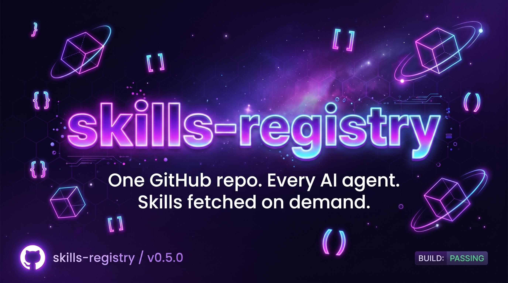
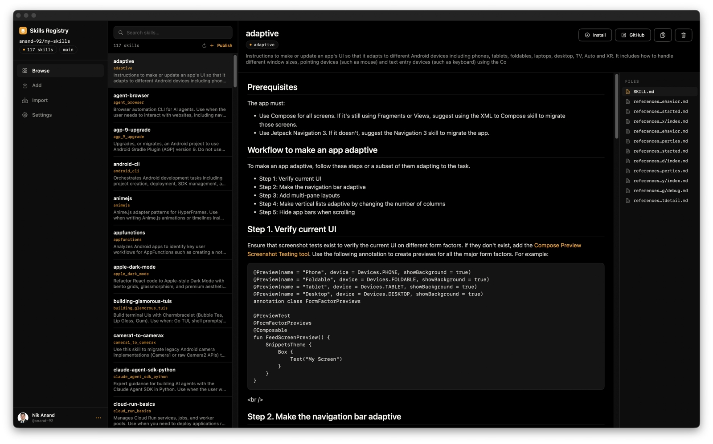

<div align="center">



# skills-registry

**One GitHub repo, every AI agent. Skills fetched on demand — not auto-loaded into every startup context.**

[](https://github.com/nikships/skills-registry/actions/workflows/ci.yml)
[](LICENSE)
[](https://modelcontextprotocol.io)
[](https://github.com/jlowin/fastmcp)
[](https://github.com/nikships/skills-registry/stargazers)

</div>

---

## What it does

AI tools like Claude Code, Cursor, Codex, Goose, and Windsurf auto-load every installed skill into the agent's startup context — tokens you pay for whether the agent uses them or not.

`skills-registry` flips this: skills live in **one GitHub repo you own**, and each agent auto-loads only a tiny **gateway skill** — a pointer file telling it *how* to search and fetch the rest on demand. That one small skill is all any agent needs. (Prefer native MCP tools? An optional hosted server exposes the same fetch-on-demand calls — see [below](#optional-hosted-mcp-server).)

**You get:**

- 🪶 **Lighter agent startup.** Skills no longer balloon every conversation's context window. Agents pull what they need, when they need it.
- 🏠 **One home for your skills.** Stop syncing `~/.claude/skills`, `~/.cursor/skills`, and `~/.factory/skills` by hand. Edit once, every agent sees it.
- 🚀 **Share and version like code.** Your registry is a Git repo — branch it, PR it, fork a teammate's, restore old versions.

---

## Quick start

> **You need:** [GitHub CLI](https://cli.github.com/) installed and authenticated (`gh auth status` succeeds), and `git` on `PATH` (only for the first-time bulk push).

**npm / npx** (any platform)

```bash
npx skills-registry          # one-off, no install
npm install -g skills-registry   # or install globally
```

**macOS / Linux**

```bash
curl -fsSL https://raw.githubusercontent.com/nikships/skills-registry/main/install.sh | sh
skills-registry
```

**Windows (PowerShell)**

```powershell
powershell -c "& ([scriptblock]::Create((irm https://raw.githubusercontent.com/nikships/skills-registry/main/install.ps1)))"
skills-registry
```

The npm package is a thin launcher that downloads the same prebuilt binary from GitHub Releases on install (or first run); the macOS builds are codesigned + notarized.

The installer drops the `skills-registry` Go binary into `~/.local/bin/`. Bare `skills-registry` routes automatically:

- **First-time users** → **onboarding wizard** (alt-screen TUI): scan dot-folders → pick repo name/visibility → push every skill with one `git push` → **install the gateway skill into the agents you pick** → optionally delete the now-redundant local copies.
- **Returning users** → **dashboard hub** with cards for Manage / Sync / Add / Publish / Purge / Settings.
- **Piped / `--json` invocations** → usage text instead of a TUI (safe to drop into scripts).


That's it — your agents are wired up. Each one now carries the gateway skill (`skills-registry/SKILL.md`), so you can just ask:

> *"What skills do I have available?"*
> *"Get the `code-review` skill and use it on this PR."*

The agent reads its gateway skill, runs `skills-registry search` / `skills-registry get` to discover and fetch what it needs, loads it into context, and cleans up the on-disk copy after. Nothing but the tiny gateway skill is ever preloaded. If the binary isn't on `PATH`, the skill tells the agent how to install it — so this self-heals.

---

## Native macOS app

Prefer a GUI? There's a native macOS app (SwiftUI, Apple Silicon) for managing your registry without the terminal: GitHub login, browse skills with rich markdown rendering and fuzzy search, publish/remove, bulk-import local skills, and a 1-click CLI install. It shares the same registry repo and config as the CLI. See [`mac-app/`](mac-app).




---

## Daily use


Run `skills-registry` for the dashboard, or use subcommands directly:

| What you want | Command |
|---|---|
| Open the dashboard | `skills-registry` |
| Browse + durably install skills into selected agent dot-folders | `skills-registry list [--query QUERY] [--plain]` |
| Fuzzy-search your registry returning top 10 matches | `skills-registry search [QUERY]` |
| Pull one skill into the global cache (`~/.cache/skills-mcp/skills/<slug>/`; override with `--dest`) | `skills-registry get <slug> [--dest PATH]` |
| Push skills sitting in `.claude/skills` etc. into the registry | `skills-registry sync [--all]` |
| Pull a skill from someone else's repo into yours + install locally | `skills-registry add <source> [--all]` |
| Publish a new skill from a local folder | `skills-registry publish <path>` |
| Delete a skill from the registry + cache + agent dot-folders | `skills-registry remove <slug>` |
| Update the installed binary to the latest release | `skills-registry update` |
| Re-run the wizard / bootstrap (idempotent) | `skills-registry bootstrap` |

Most users only touch `list`, `get`, and `publish`. The TUI is fuzzy-filterable; press `/` to search, Enter on a row to pick which agent dot-folders should receive a durable install — `.agents/skills` is always-on; popular agents are pre-checked. `get` stays the cache-only fetch for one-shot agent reads.


### Import a public skill repo

`add` scans every nested `SKILL.md` in the source repo before publishing selected skills into your own registry. For example, a user can import the TweetClaw skill for OpenClaw and Xquik without copying files by hand:

```bash
skills-registry add Xquik-dev/tweetclaw
skills-registry get tweetclaw
```

That keeps the public source repo as the import target while the user's registry owns the stored copy, version history, and local agent install. TweetClaw covers X/Twitter jobs such as tweet scraping, tweet and reply search, follower export, user lookup, media workflows, tweet monitoring, webhooks, giveaway draws, and approval-gated posting.

### `remove`: delete a skill end-to-end

```bash
skills-registry remove code-review
```

`remove` is destructive. It deletes the slug from three places at once:

1. The GitHub registry repo — single atomic commit via the Git Data API.
2. The local cache (`~/.cache/skills-mcp/skills/<slug>/` + `<slug>.meta.json`).
3. Every known AI tool dot-folder copy (`~/.claude/skills/<slug>/`, `~/.factory/skills/<slug>/`, `.agents/skills/<slug>/`, …).

Interactive runs prompt for confirmation first. Pass `--yes` to skip it, or `--json` (which implies `--yes`) for machine-readable output. Removing a slug that isn't in the registry exits 1 cleanly — nothing destructive runs.

### `update`: self-update the installed binary

```bash
skills-registry update                  # pull the newest GitHub release
skills-registry update --dry-run        # show what would change, write nothing
skills-registry update --version v0.6.0 # pin a specific tag
skills-registry update --force          # reinstall even if you're already current
```

`update` mirrors the installer — it hits `api.github.com` to resolve the latest tag, downloads `skills-registry_<os>_<arch>.tar.gz` (or `.zip` on Windows) directly from GitHub Releases, and atomically swaps the binary in place. No `gh` required, no auth, no shell state. Supports `darwin/linux/windows × amd64/arm64`. Set `SKILLS_REGISTRY_AUTO_UPDATE=1` in your shell to check for updates automatically right before the hub opens.

### Programmatic use — `--json`

Every subcommand accepts a persistent `--json` flag. With it, the CLI suppresses TUIs and prompts and emits a single JSON payload to stdout. Errors land as `{"error": "..."}` with a non-zero exit. Use this when an agent or script drives the binary.

| Command | Payload shape |
|---|---|
| `skills-registry list --json` | `[{"slug", "name", "description"}, …]` |
| `skills-registry search [QUERY] --json` | `[{"slug", "name", "description"}, …]` |
| `skills-registry get <slug> --json` | `{"slug", "path"}` (on-disk dest) |
| `skills-registry publish <path> --json` | `{"slug", "sha", "url"}` |
| `skills-registry sync --json` | `{"pushed": [...slugs], "skipped": [...slugs]}` |
| `skills-registry add <source> --json` | `{"pushed": [...slugs], "skipped": [...slugs], "installed": {<slug>: [...paths]}}` |
| `skills-registry remove <slug> --json` | `{"slug", "removed_from": [...], "sha", "repo"}` |
| `skills-registry update --json` | `{"updated", "version", "asset", "path", "message"}` |

Destructive commands (`sync`, `remove`) auto-promote `--yes` when `--json` is set, so piped invocations never hang on a Bubble Tea prompt that can't render.

---

## vs. the alternatives

|  | Local dot-folders | Dotfiles repo | **skills-registry** |
|---|:---:|:---:|:---:|
| One home for all your agents | ❌ duplicated | ✅ | ✅ |
| Fetched on demand (no startup tokens) | ❌ | ❌ | ✅ |
| Versioned + branchable | ❌ | ✅ | ✅ |
| Works in any agent (skill or MCP) | partial | ❌ | ✅ |
| Share / fork between users | ❌ | clunky | ✅ (just clone the repo) |
| No shell or SSH config needed | ✅ | ❌ | ✅ |

---

## Configuration

The wizard sets sensible defaults. Override via shell env when needed:

| Variable | Default | What it does |
|---|---|---|
| `SKILLS_REGISTRY` | (from config) | Point at a different registry for one command: `owner/repo` or `owner/repo@branch`. Great for browsing a teammate's. |
| `SKILLS_LOG_LEVEL` | `INFO` | Bump to `DEBUG` when debugging. |
| `SKILLS_REGISTRY_VERSION` | `latest` | Pin the installer to a release tag (`v0.7.0`, etc.). |
| `SKILLS_BIN_DIR` | `~/.local/bin` | Where the installer drops the `skills-registry` binary. |
| `SKILLS_REGISTRY_AUTO_UPDATE` | unset | Set to `1`/`true`/`yes` to opportunistically run `skills-registry update` before opening the hub. Errors are warning-logged, never fatal. |
| `XDG_CONFIG_HOME` / `XDG_CACHE_HOME` | OS default | Where the registry config and skill cache live. |

The registry repo itself (as an `owner/repo` slug) lives in `~/.config/skills-mcp/registry.toml`.

---

## Troubleshooting

<details>
<summary><strong>"gh not found" or exit code 3</strong></summary>

Install GitHub CLI from <https://cli.github.com/> and run `gh auth login`. `skills-registry` uses `gh` for every GitHub call — no SSH keys, no `git config user.email` required — so it must be on your `PATH` (or in `~/.local/bin`, `/opt/homebrew/bin`, `/usr/local/bin`, or `/usr/bin`).
</details>

<details>
<summary><strong>"No registry configured"</strong></summary>

The wizard hasn't run yet, or `~/.config/skills-mcp/registry.toml` is missing. Run `skills-registry` (it opens the wizard first run), or set `SKILLS_REGISTRY=owner/repo` directly.
</details>

<details>
<summary><strong>The MCP server doesn't show up in my client</strong></summary>

Paste the wizard's JSON snippet into your client's MCP config and fully restart the client (not just reload). On first connect the client opens a browser to authorize the Skills Registry GitHub App on your registry repo — accept it. If the server says "no repo linked yet", install the GitHub App via the link in the error and retry; the webhook auto-links within seconds.
</details>

<details>
<summary><strong>Multiple GitHub accounts</strong></summary>

`skills-registry` uses whichever account `gh auth status` reports active. Use `gh auth switch` to pick the right one.
</details>

<details>
<summary><strong>"git not found" during onboarding</strong></summary>

The first-time bulk push uses a single `git push` to dodge GitHub's secondary rate limit. Install git (macOS: `brew install git`; Linux: `apt install git` / `dnf install git`; Windows: https://git-scm.com/downloads) and re-run. After onboarding, `git` is no longer needed — `publish` and `remove` route through `gh api`.
</details>

---

## Optional: hosted MCP server

The gateway skill is all you need. But if your client supports MCP and you'd rather it call native `search_skills` / `get_skill` tools (no local binary required for reads), there's an optional hosted server. Add it by hand:

```json
{
  "mcpServers": {
    "skills-registry": {
      "url": "https://mcp.skills-registry.dev/mcp"
    }
  }
}
```

Drop it into your client's `mcp.json` (Claude Code, Claude Desktop, Cursor, VS Code+Copilot all use the same shape). On first connect, your client opens a browser to authorize the Skills Registry GitHub App on your registry repo. After that, every `search_skills` / `get_skill` call goes through the hosted server. Writes (`publish` / `sync` / `remove`) still go through the CLI — the hosted server is read-only.

> **Codex.** Codex uses TOML instead of JSON, but it speaks the same Streamable HTTP. Add this to `~/.codex/config.toml`:
>
> ```toml
> [mcp_servers.skills-registry]
> enabled = true
> url = "https://mcp.skills-registry.dev/mcp"
> ```

---

## Project status

`skills-registry` is at **v0.7** — usable day-to-day but pre-1.0. The gateway skill + CLI commands (`list` / `get` / `sync` / `add` / `publish` / `remove` / `search`) and the optional hosted MCP read tools (`search_skills`, `get_skill`) are stable. Internals may shift between minor versions; pin a CLI release with `SKILLS_REGISTRY_VERSION` if needed.

Found a bug? Have an idea? [Open an issue](https://github.com/nikships/skills-registry/issues). PRs welcome — see [`CONTRIBUTING.md`](CONTRIBUTING.md).

---

[Apache-2.0](LICENSE) · made by [@nikships](https://github.com/nikships)
