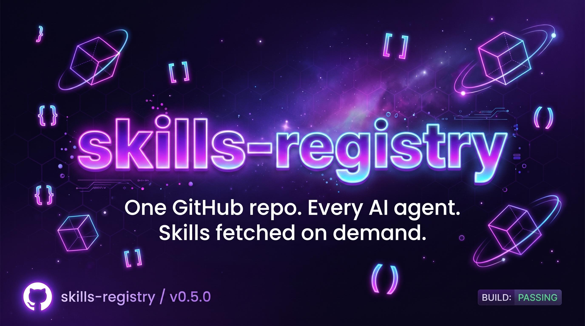
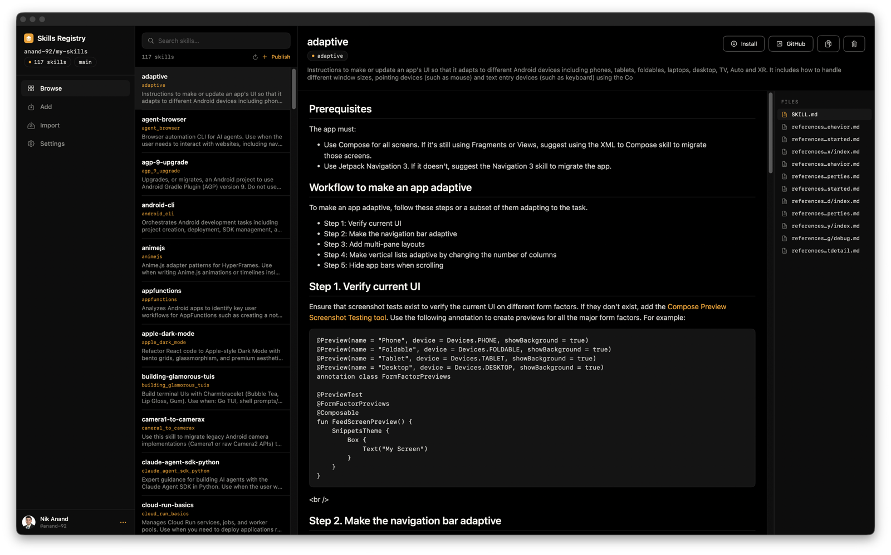

<div align="center">



# skills-registry

**One GitHub repo, every AI agent. Skills fetched on demand — not auto-loaded into every startup context.**

[](https://github.com/nikships/skills-registry/actions/workflows/ci.yml)
[](LICENSE)
[](https://github.com/nikships/skills-registry/stargazers)

</div>

---

## What it does

AI tools like Claude Code, Cursor, Codex, Goose, and Windsurf auto-load every installed skill into the agent's startup context — tokens you pay for whether the agent uses them or not.

`skills-registry` flips this: skills live in **one GitHub repo you own**, and each agent auto-loads only a tiny **gateway skill** — a pointer file telling it how to use the CLI to search and fetch the rest on demand. That one small skill is all any agent needs.

**You get:**

- 🪶 **Lighter agent startup.** Skills no longer balloon every conversation's context window. Agents pull what they need, when they need it.
- 🏠 **One home for your skills.** Stop syncing `~/.claude/skills`, `~/.cursor/skills`, and `~/.factory/skills` by hand. Edit once, every agent sees it.
- 🚀 **Share and version like code.** Your registry is a Git repo — branch it, PR it, fork a teammate's, restore old versions.

---

## Quick start

> **You need:** [GitHub CLI](https://cli.github.com/) installed and authenticated (`gh auth status` succeeds), and `git` on `PATH` (only for the first-time bulk push).

**npm / npx** (any platform)

```bash
npx skills-registry          # one-off, no install
npm install -g skills-registry   # or install globally
```

**macOS / Linux**

```bash
curl -fsSL https://raw.githubusercontent.com/nikships/skills-registry/main/install.sh | sh
skills-registry
```

**Windows (PowerShell)**

```powershell
powershell -c "& ([scriptblock]::Create((irm https://raw.githubusercontent.com/nikships/skills-registry/main/install.ps1)))"
skills-registry
```

The npm package is a thin launcher that downloads the same prebuilt binary from GitHub Releases on install (or first run); the macOS builds are codesigned + notarized.

The installer drops the `skills-registry` Go binary into `~/.local/bin/`. Bare `skills-registry` routes automatically:

- **First-time users** → **seven-step onboarding wizard** (alt-screen TUI): scan dot-folders → pick repo name/visibility → push every skill with one `git push` → **install the gateway skill into the agents you pick** → optionally delete the now-redundant local copies → show the registry URL.
- **Returning users** → **dashboard hub** with cards for Manage / Sync / Add / Discover / Publish / Purge / Settings.
- **Piped / `--json` invocations** → usage text instead of a TUI (safe to drop into scripts).


That's it — your agents are wired up. Each one now carries the gateway skill (`skills-registry/SKILL.md`), so you can just ask:

> *"What skills do I have available?"*
> *"Get the `code-review` skill and use it on this PR."*

The agent reads its gateway skill, runs `skills-registry search` / `skills-registry get` to find and fetch what it needs, loads it into context, and cleans up the on-disk copy after. Nothing but the tiny gateway skill is ever preloaded. If the binary isn't on `PATH`, the skill tells the agent how to install it — so this self-heals.

The gateway searches **your** registry first. Only when that comes up empty does it mention `discover` and the public index, and it must ask you before importing anything — so a normal prompt never fans out to a third-party index, and a stranger's skill never lands in your agent folders without you saying yes.

---

## Native macOS app

Prefer a GUI? There's a native macOS app (SwiftUI, Apple Silicon) for managing your registry without the terminal: GitHub login, browse skills with rich markdown rendering and fuzzy search, publish/remove, bulk-import local skills, and a 1-click CLI install. It shares the same registry repo and config as the CLI. The app checks the login-shell PATH when it reports whether `~/.local/bin` is available, including when the app was launched from Finder. See [`mac-app/`](mac-app).



### CI and macOS releases

Native macOS CI and release jobs run on a dedicated, Aqua-session self-hosted
runner labeled `mac-mini`; Linux, Windows, and untrusted fork jobs remain on
GitHub-hosted runners. The Mini requires its external NVMe volume mounted for
Xcode and uses an isolated CI keychain for its Developer ID signing identity.
See [`.github/AGENTS.md`](.github/AGENTS.md) for runner operations and signing
guidance.


---

## Daily use


Run `skills-registry` for the dashboard, or use subcommands directly:

| What you want | Command |
|---|---|
| Open the dashboard | `skills-registry` |
| Browse + durably install skills into selected agent dot-folders | `skills-registry list [--query QUERY] [--plain]` |
| Fuzzy-search your registry returning top 10 matches | `skills-registry search [QUERY]` |
| Search the public skill index and import a skill from it | `skills-registry discover <QUERY> [--mode keyword\|vector] [--category CAT] [--limit N] [--plain]` |
| Pull one skill into the global cache (`~/.cache/skills-registry/skills/<slug>/`; override with `--dest`) | `skills-registry get <slug> [--dest PATH]` |
| Push skills sitting in `.claude/skills` etc. into the registry | `skills-registry sync [--all]` |
| Pull a skill from someone else's repo (or one folder of it) into yours | `skills-registry add <source> [--all] [--install] [--allow-unsafe]` |
| Publish a new skill from a local folder | `skills-registry publish <path>` |
| Delete a skill from the registry + cache + agent dot-folders | `skills-registry remove <slug>` |
| Update the installed binary to the latest release | `skills-registry update` |
| Re-run the wizard / bootstrap (idempotent) | `skills-registry bootstrap` |

Most users only touch `list`, `get`, and `publish`. The TUI is fuzzy-filterable; press `/` to search, Enter on a row to pick which agent dot-folders should receive a durable install — `.agents/skills` is always-on; popular agents are pre-checked. `get` stays the cache-only fetch for one-shot agent reads.


### `discover`: find third-party skills to import

`search` fuzzy-ranks the skills already in your own registry. `discover` is the outward-facing counterpart: it queries the public [SkillNet](http://api-skillnet.openkg.cn) index of published skills (tens of thousands of them) and lets you import one straight into your registry.

```bash
skills-registry discover pdf
skills-registry discover "summarize a youtube video" --mode vector
skills-registry discover pdf --category Productivity --limit 25
skills-registry discover pdf --plain    # the table instead of the picker
skills-registry discover pdf --json
```

The dashboard hub's **Discover** card runs the same picker: it asks for a query, then opens the identical result list and import path. Nothing is sent to the index until you submit that query, so an idle dashboard makes no index request.

On a terminal this opens an interactive picker: browse the ranked hits with a preview pane showing each skill's author, the index's three grades, and the exact GitHub folder it would fetch. Press Enter to import the selected row — it goes through the same gate as `add <url>`, so it publishes to your registry only, writes nothing into an agent folder unless you opt in, and needs an extra confirmation if the index graded it `Poor` for safety. Esc or `q` exits having written nothing.

Pipe the output, or pass `--plain` or `--json`, and you get the fixed-width table instead, which downloads nothing:

```
Skill index (skillnet): 2 results for "pdf" (keyword mode)

  NAME       CATEGORY      SAFETY  AUTHOR    URL
  ─────────  ────────────  ──────  ────────  ───
  summarize  AIGC          Good    openclaw  https://github.com/openclaw/openclaw/blob/1300b22/skills/summarize
  nano-pdf   Productivity  Good    clawdbot  https://github.com/clawdbot/clawdbot/blob/02aeff8/skills/nano-pdf

  Import one with: skills-registry add <URL>
```

`--mode keyword` (the default) matches literal terms; `--mode vector` ranks by embedding similarity, which is better when you can describe what you want but not name it. `--limit` is capped at 50.

The `skill_url` column is exactly the `/blob/<sha>/<dir>` shape `add` accepts, so importing a result from the table is a copy-paste:

```bash
skills-registry add https://github.com/openclaw/openclaw/blob/1300b22/skills/summarize
```

The safety, completeness, and executability columns are the index's own grades (`Good` / `Average` / `Poor`). A skill the index has not graded shows as `unscored`, which means unvetted, not safe — read any third-party skill's source before importing it. GitHub star counts are deliberately not shown or sorted on: they belong to the host repository (the OpenClaw monorepo alone has 372k), so they say nothing about an individual skill.

**Transport, plainly:** the index endpoint is plain HTTP, because the host serves a TLS certificate that does not match it, so HTTPS cannot be verified. Your search terms therefore travel in plaintext. In exchange, the request carries no credentials whatsoever — no GitHub token, no `gh` auth header, no cookie, no registry contents — so a plaintext hop leaks nothing but the query itself. This is enforced by tests. Set `SKILLS_DISCOVER_URL` to point at a mirror or a local endpoint instead. If the index is unreachable, `discover` exits 1 and reminds you that `add <github-url>` still works without it — the picker says the same thing rather than showing you an empty list.

### Public skills are untrusted: the import gate

A skill is prose your agents read as instructions. Publishing a stranger's `SKILL.md` into your own registry is one commit you can revert; **copying it into your agent dot-folders is different**, because from then on every agent loads it every session with no further prompt. So `add` treats the two differently depending on where the source came from.

**Trusted** (behaves exactly as before — publish, then pick agent folders to install into):

- a local directory (`./skills/pdf`)
- a GitHub repository under your own registry's owner, in any URL shape

**Untrusted** (gated):

- any third-party `github.com` `/tree/` or `/blob/` URL
- a third-party `owner/repo` shorthand
- any non-GitHub git remote (nothing in the URL says who wrote it)
- anything you pass with `--from-discover`, i.e. a pick out of the public index

For an untrusted source:

```bash
# Default: publish to your registry. Nothing is written to any agent folder.
skills-registry add https://github.com/openclaw/openclaw/blob/1300b22/skills/summarize

# Opt in to the durable install into agent dot-folders.
skills-registry add https://github.com/openclaw/openclaw/blob/1300b22/skills/summarize --install

# Import despite a Poor safety grade or a local scan hit.
skills-registry add https://github.com/some/repo/tree/main/skills/x --allow-unsafe
```

Before anything is written, `add` shows the public index's grades for the folder and the result of a local scan:

```
!  Untrusted source — a public GitHub repository owned by openclaw
   Public skill index grades:
     safety:        Good
     completeness:  unscored
     executability: unscored
   Default: publish to your registry only. No agent dot-folder is written
   unless you opt in, and nothing under scripts/ is ever run.
   Local scan: no suspicious patterns. The local scan is a regex heuristic, not a guarantee: …
```

A grade the index never assigned reads as `unscored`, never as a pass. **`unscored` means unvetted, not safe.**

`Poor` safety is a blocker: interactively you get an extra confirmation whose default answer is "cancel", and non-interactively (`--json`, or `--yes`) the skill is refused unless you pass `--allow-unsafe`. `--yes` deliberately does *not* clear a blocker — asking to skip prompts is not agreeing to import a skill graded unsafe.

**The local scan is a heuristic warning layer, not a guarantee.** It is a small set of regexes over `SKILL.md` looking for three shapes: prompt injection (`ignore all previous instructions`, `do not tell the user`, jailbreak framing), credential exfiltration (reading `~/.ssh/id_*`, `.aws/credentials`, `.env`, or the environment *and* shipping it somewhere on the same line), and remote code execution (`curl … | sh`, `wget … | bash`, `eval "$(curl …)"`, `IEX (New-Object Net.WebClient).DownloadString …`). There is no model and no sandbox: obfuscation, a payload split across lines, and anything phrased indirectly all get through. A clean scan means "none of these patterns matched", never "this skill is safe". Read the source.

**Nothing fetched is ever executed.** `scripts/`, `references/`, and `assets/` are copied as bytes; `add` and `discover` never run any of it. The only process either command spawns is `git` (for a clone-path source) or `gh` (for API calls).

**An untrusted import carries its provenance.** The copy written into your registry gains two frontmatter keys, so where it came from lives in the file rather than only in the commit message:

```yaml
---
name: summarize
description: Summarize URLs and PDFs.
category: AIGC
source_url: https://github.com/openclaw/openclaw/tree/1300b22/skills/summarize
---
```

`source_url` is the GitHub *folder* URL, so it ends in the skill's own directory. `category` is the public index's, and is omitted when the index has no row for the folder — an absent category is never guessed. The body is the upstream skill unmodified, and an upstream file that already declares either key keeps its own value. Skills already in your registry without these keys stay valid, and `skills-registry publish ./my-skill` never adds them: a folder you wrote is not an import.

### Import a public skill repo

`add` scans every nested `SKILL.md` in the source repo before publishing selected skills into your own registry. For example, a user can import the TweetClaw skill for OpenClaw and Xquik without copying files by hand:

```bash
skills-registry add Xquik-dev/tweetclaw          # third-party: registry only
skills-registry add Xquik-dev/tweetclaw --install # …and into agent folders
skills-registry get tweetclaw
```

That keeps the public source repo as the import target while the user's registry owns the stored copy and version history. TweetClaw covers X/Twitter jobs such as tweet scraping, tweet and reply search, follower export, user lookup, media workflows, tweet monitoring, webhooks, giveaway draws, and approval-gated posting.

### Import one skill folder out of a monorepo

`add` also takes a GitHub folder URL — the `/tree/` link you get from the address bar, or the `/blob/` link the public skill index hands out:

```bash
skills-registry add https://github.com/owner/repo/tree/main/skills/pdf
skills-registry add https://github.com/owner/repo/blob/<commit-sha>/skills/pdf
```

For those, only that folder is downloaded, through the GitHub Contents API with your existing `gh` credentials — `SKILL.md` plus `scripts/`, `references/`, `assets/`, and anything else nested inside it. The parent repository is never cloned, so pulling one skill out of a 100k-star monorepo costs a handful of API calls instead of a full clone. `<ref>` may be a branch (including one containing slashes), a tag, or a full commit SHA. Point the URL at a `SKILL.md` and its folder is imported; point it at a folder of skill folders and every skill inside is offered.

Everything else keeps the previous behavior: `owner/repo` shorthand, a bare `github.com/owner/repo` link, a `/tree/<branch>` link with no folder, and any non-GitHub git URL are shallow-cloned (`--depth=1 --single-branch`) and walked for every nested `SKILL.md`.

| Source | Behavior |
|---|---|
| `./local/path` | Used in place, no copy. |
| `owner/repo` | Shallow clone, every nested `SKILL.md`. |
| `https://github.com/owner/repo` | Shallow clone. |
| `https://github.com/owner/repo/tree/<branch>` | Shallow clone, branch pinned. |
| `https://github.com/owner/repo/tree/<ref>/<dir>` | Contents-API fetch of `<dir>` only. |
| `https://github.com/owner/repo/blob/<sha>/<dir>` | Contents-API fetch of `<dir>` only. |
| `https://gitlab.com/owner/repo.git`, `git@…` | Shallow clone, as-is. |

### `remove`: delete a skill end-to-end

```bash
skills-registry remove code-review
```

`remove` is destructive. It deletes the slug from three places at once:

1. The GitHub registry repo — single atomic commit via the Git Data API.
2. The local cache (`~/.cache/skills-registry/skills/<slug>/` + `<slug>.meta.json`).
3. Every known AI tool dot-folder copy (`~/.claude/skills/<slug>/`, `~/.factory/skills/<slug>/`, `.agents/skills/<slug>/`, …).

Interactive runs prompt for confirmation first. Pass `--yes` to skip it, or `--json` (which implies `--yes`) for machine-readable output. Removing a slug that isn't in the registry exits 1 cleanly — nothing destructive runs.

### `update`: self-update the installed binary

```bash
skills-registry update                  # pull the newest GitHub release
skills-registry update --dry-run        # show what would change, write nothing
skills-registry update --version v0.6.0 # pin a specific tag
skills-registry update --force          # reinstall even if you're already current
```

`update` mirrors the installer — it hits `api.github.com` to resolve the latest tag, downloads `skills-registry_<os>_<arch>.tar.gz` (or `.zip` on Windows) directly from GitHub Releases, and atomically swaps the binary in place. No `gh` required, no auth, no shell state. Supports `darwin/linux/windows × amd64/arm64`. Set `SKILLS_REGISTRY_AUTO_UPDATE=1` in your shell to check for updates automatically right before the hub opens.

### Programmatic use — `--json`

Every subcommand accepts a persistent `--json` flag. With it, the CLI suppresses TUIs and prompts and emits a single JSON payload to stdout. Errors land as `{"error": "..."}` with a non-zero exit. Use this when an agent or script drives the binary.

| Command | Payload shape |
|---|---|
| `skills-registry list --json` | `[{"slug", "name", "description"}, …]` |
| `skills-registry search [QUERY] --json` | `[{"slug", "name", "description"}, …]` |
| `skills-registry discover <QUERY> --json` | `{"source", "query", "mode", "results": [{"name", "description", "author", "category", "skill_url", "safety", "completeness", "executability"}, …]}` |
| `skills-registry get <slug> --json` | `{"slug", "path"}` (on-disk dest) |
| `skills-registry publish <path> --json` | `{"slug", "sha", "url"}` |
| `skills-registry sync --json` | `{"pushed": [...slugs], "skipped": [...slugs]}` |
| `skills-registry add <source> --json` | `{"pushed": [...slugs], "skipped": [...slugs], "installed": {<slug>: [...paths]}, "source": {"origin", "untrusted", "reason"}, "install_skipped": bool, "install_skipped_reason": "…"}` |
| `skills-registry remove <slug> --json` | `{"slug", "removed_from": [...], "sha", "repo"}` |
| `skills-registry update --json` | `{"updated", "version", "asset", "path", "message"}` |

Destructive commands (`sync`, `remove`) auto-promote `--yes` when `--json` is set, so piped invocations never hang on a Bubble Tea prompt that can't render.

`add --json` respects the import gate. For an untrusted source it publishes but writes no agent dot-folder unless `--install` is set, and says so via `install_skipped` / `install_skipped_reason`. A skill blocked by a `Poor` safety grade or a local scan hit is refused with `{"error": "refused 1 skill(s) — …; pass --allow-unsafe to import anyway (…)"}` and exit 1; nothing is published in that run. `--yes` does not clear a block.

---

## vs. the alternatives

|  | Local dot-folders | Dotfiles repo | **skills-registry** |
|---|:---:|:---:|:---:|
| One home for all your agents | ❌ duplicated | ✅ | ✅ |
| Fetched on demand (no startup tokens) | ❌ | ❌ | ✅ |
| Versioned + branchable | ❌ | ✅ | ✅ |
| Works in any supported agent | partial | ❌ | ✅ |
| Share / fork between users | ❌ | clunky | ✅ (just clone the repo) |
| No shell or SSH config needed | ✅ | ❌ | ✅ |

---

## Configuration

The wizard sets sensible defaults. Override via shell env when needed:

| Variable | Default | What it does |
|---|---|---|
| `SKILLS_REGISTRY` | (from config) | Point at a different registry for one command: `owner/repo` or `owner/repo@branch`. Great for browsing a teammate's. |
| `SKILLS_LOG_LEVEL` | `INFO` | Bump to `DEBUG` when debugging. |
| `SKILLS_REGISTRY_VERSION` | `latest` | Pin the installer to a release tag (`v0.7.0`, etc.). |
| `SKILLS_BIN_DIR` | `~/.local/bin` | Where the installer drops the `skills-registry` binary. |
| `SKILLS_REGISTRY_AUTO_UPDATE` | unset | Set to `1`/`true`/`yes` to opportunistically run `skills-registry update` before opening the hub. Errors are warning-logged, never fatal. |
| `SKILLS_DISCOVER_URL` | `http://api-skillnet.openkg.cn/v1/search` | Endpoint `discover` searches. Point it at a mirror or a local index. Plain HTTP by necessity; no credentials are ever attached. |
| `XDG_CONFIG_HOME` / `XDG_CACHE_HOME` | OS default | Where the registry config and skill cache live. |

The registry repo itself (as an `owner/repo` slug) lives in `~/.config/skills-registry/registry.toml`.

---

## Troubleshooting

<details>
<summary><strong>"gh not found" or exit code 3</strong></summary>

Install GitHub CLI from <https://cli.github.com/> and run `gh auth login`. `skills-registry` uses `gh` for every GitHub call — no SSH keys, no `git config user.email` required — so it must be on your `PATH` (or in `~/.local/bin`, `/opt/homebrew/bin`, `/usr/local/bin`, or `/usr/bin`).
</details>

<details>
<summary><strong>"No registry configured"</strong></summary>

The wizard hasn't run yet, or `~/.config/skills-registry/registry.toml` is missing. Run `skills-registry` (it opens the wizard first run), or set `SKILLS_REGISTRY=owner/repo` directly.
</details>

<details>
<summary><strong>Multiple GitHub accounts</strong></summary>

`skills-registry` uses whichever account `gh auth status` reports active. Use `gh auth switch` to pick the right one.
</details>

<details>
<summary><strong>"git not found" during onboarding</strong></summary>

The first-time bulk push uses a single `git push` to dodge GitHub's secondary rate limit. Install git (macOS: `brew install git`; Linux: `apt install git` / `dnf install git`; Windows: https://git-scm.com/downloads) and re-run. After onboarding, `git` is no longer needed — `publish` and `remove` route through `gh api`.
</details>

---

## Project status

`skills-registry` is at **v0.7** — usable day-to-day but pre-1.0. The gateway skill and CLI commands (`list` / `get` / `sync` / `add` / `publish` / `remove` / `search`) are stable. `discover` is new; its `--json` payload is a published contract, but the table's layout and the picker's chrome may still change. Internals may shift between minor versions; pin a CLI release with `SKILLS_REGISTRY_VERSION` if needed.

Found a bug? Have an idea? [Open an issue](https://github.com/nikships/skills-registry/issues). PRs welcome — see [`CONTRIBUTING.md`](CONTRIBUTING.md).

---

[Apache-2.0](LICENSE) · made by [@nikships](https://github.com/nikships)
