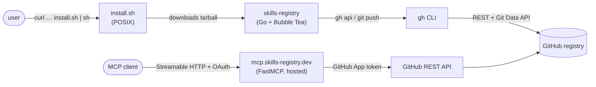
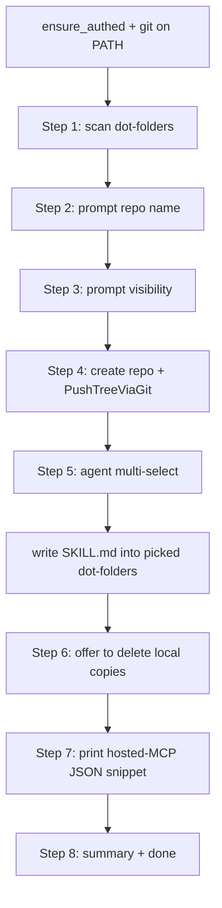
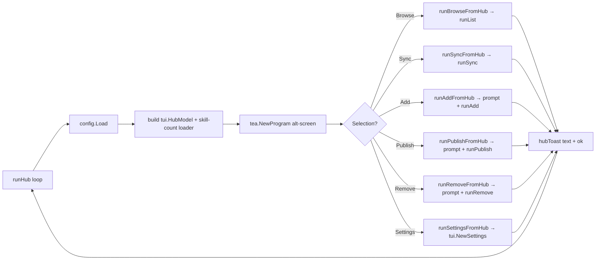

# Skill Registry — architecture deep dive

How the two pieces (`install.sh` + `skills-registry` Go CLI on the user's machine, and the hosted MCP server) cooperate, what each does on the wire, and where to look when something breaks.

---

## 1. Bird's-eye view



Two user-facing deliverables, **single repo**, two languages.

| Piece | Language | Distribution | Role |
|---|---|---|---|
| `install.sh` | POSIX sh | Raw GitHub Content (`curl \| sh`) | One-shot installer. Detects OS/arch, downloads the matching Go tarball, drops the binary into `~/.local/bin/skills-registry`. |
| `skills-registry` | Go | GitHub Releases (`darwin/linux/windows × amd64/arm64`, built by `.github/workflows/release.yml`) | Everything the user touches: routing (wizard / hub / help), TUI, and headless subcommands (`bootstrap`, `list`, `get`, `sync`, `add`, `publish`, `remove`). All honor `--json`. |
| `skills-registry-mcp` (hosted) | Python (FastMCP) | Docker image on Railway, served at `https://mcp.skills-registry.dev/mcp` | Streamable HTTP MCP server. **Two read-only tools**: `search_skills`, `get_skill`. The hosted server never writes — `publish` / `sync` / `add` / `remove` all happen through the Go CLI. Users never install this; their MCP client connects to the URL and does the OAuth dance. |

> **Source layout.** The hosted server (code, Dockerfile, Railway config) lives in [`infa-not-for-users/`](../infa-not-for-users) (maintainer-only). The Go CLI lives in [`cli/`](../cli). Users see only the CLI; the hosted server is a service, not a deliverable.

### 1.1 Hosted MCP — what runs where

The hosted server is a single FastMCP Streamable-HTTP process behind a TLS-terminating proxy:

1. **Auth.** MCP clients (Claude Code / Cursor / VS Code+Copilot / Claude Desktop) negotiate OAuth on first connect — a browser window opens to the server's `/authorize` endpoint, which hands off to GitHub. The resulting token is scoped to the user's GitHub identity.
2. **Repo linking.** After OAuth, the server needs to know *which* repo to serve. Users install the **Skills Registry GitHub App** on their registry repo; an `installation` webhook records the `{github_user → owner/repo}` link in the server's key-value store. Subsequent tool calls resolve the user's repo from that link.
3. **GitHub I/O.** Both reads (`search_skills`, `get_skill`) use an installation-scoped GitHub App token via the GitHub Contents API. The server is read-only — there is no write tool. The user's local `gh` is not involved either; the server runs in a Docker container with no shell state.
4. **Persistence.** A small Railway-backed volume at `/data/oauth/` holds the OAuth state + repo-link table. No skills are cached server-side; every `get_skill` reads through to GitHub.

The CLI (`skills-registry list`, `skills-registry search`, `get`, …) is separate — it makes GitHub calls via the user's local `gh`. The hosted MCP and the CLI are two independent paths to the same GitHub data, optimized for different environments (browser-OAuth on remote compute vs. local `gh`).

---

## 2. Install + first-run

The user-facing entry point is a single shell command:

```bash
curl -fsSL https://raw.githubusercontent.com/anand-92/skills-registry/main/install.sh | sh
```

`install.sh` (POSIX `sh`, ~150 LOC):

1. Detect OS via `uname -s`, arch via `uname -m`. Map to `darwin/linux × amd64/arm64`. Unsupported tuples exit 2 — never silently wrong-asset.
2. Build the release URL (`SKILLS_REGISTRY_VERSION=latest` by default, pinnable to a tag).
3. Download via `curl -fsSL` (fall back to `wget`).
4. `tar -xzf` into a `mktemp -d`, atomically move the binary into `~/.local/bin/skills-registry` (overridable via `SKILLS_BIN_DIR`).
5. Warn if the install dir isn't on `PATH`.

The CLI never installs Python or an MCP entry point — the hosted server replaces that. The wizard's final step is just a static JSON snippet pointing at the hosted URL.

### 2.1 Bare-command routing (`skills-registry`, no subcommand)

`cli/cmd/skills-registry/main.go:bareRouteDecision` is the single decision function for bare `skills-registry`. It's pure (no I/O), unit-tested, and produces one of four routes:

| isTTY | --json | config load err | → route | what fires |
|---|---|---|---|---|
| any | `true` | any | `bareRouteHelp` | print usage; exit 0 |
| `false` | `false` | any | `bareRouteHelp` | print usage; exit 0 |
| `true` | `false` | `ErrMissing` (wrapped via `errors.Is` too) | `bareRouteWizard` | first-run onboarding |
| `true` | `false` | nil | `bareRouteHub` | dashboard hub |
| `true` | `false` | other | `bareRouteError` | surface the parse error |

Bare `skills-registry` should always land somewhere safe. Non-TTY or `--json` → no Bubble Tea. Otherwise route by config presence.

### 2.2 First-run wizard

`cli/cmd/skills-registry/wizard.go:runWizard` is an alt-screen Bubble Tea program that owns the full 8-step bootstrap flow:



All four legacy headless-bootstrap concerns (repo create, push, agent install, cleanup) live inside the wizard. Step 7 is informational — the wizard never installs or launches a server; it prints the JSON snippet pointing at `https://mcp.skills-registry.dev/mcp` for the user to paste into their MCP client config. Re-running is safe: the wizard reuses an existing `~/.config/skills-mcp/registry.toml` and short-circuits repo creation. The legacy `skills-registry bootstrap` subcommand still exists for scripted use; the wizard is the interactive face of the same primitives.

**Why `git push` for bootstrap?** A first-time user with 30+ skills (≈100+ files) trips GitHub's secondary rate limit at ~80 POSTs/minute when each file uploads as a separate `git/blobs` REST call. `PushTreeViaGit` collapses that into one `git push` of the whole tree, regardless of file count. Credentials come from `gh auth setup-git` (idempotent — wires `gh` as git's HTTPS credential helper for github.com).

`PushTreeViaGit` requires `git` on PATH; the wizard fails fast before rendering any screen when it's missing. Single-skill CLI `publish` / `remove` do **not** use this — they stay on the REST blob path, well under the rate limit.

### 2.3 Returning-user hub

`cli/cmd/skills-registry/hub.go:runHub` is the loop a bare `skills-registry` enters once config exists:



Each per-action helper returns a `hubToast`. The next loop iteration seeds that toast into the freshly-built `tui.HubModel`, so the user sees "✓ added from owner/repo" / "✗ remove: slug not found" / etc. Per-action errors land as red toasts and the user can retry; only a launcher-level failure (e.g. `config.Load` failing mid-session) escapes the loop. The hub terminates on quit (`q` / `esc` / `ctrl+c`) or empty selection.

### 2.4 MCP wire-up

The wizard's step 7 (`WizardStepMCPConnect`) and the headless `bootstrap` subcommand both print the same JSON blob:

```json
{
  "mcpServers": {
    "skills-registry": {
      "url": "https://mcp.skills-registry.dev/mcp"
    }
  }
}
```

The URL constant lives at `cli/internal/bootstrap/install.go:HostedMCPURL`; `MCPJSONSnippet()` formats it for `mcp.json`. No binary path is computed, no install is attempted, no goroutine runs — `startMCPConnect` synchronously snapshots the snippet, the renderer shows it inside a `PanelStyle` code block, and the user pastes it into their client config.

**Codex is intentionally unsupported by the hosted MCP.** Codex's TOML config only accepts stdio MCP servers (`command = "..."`), and the hosted service speaks Streamable HTTP. The wizard and README call this out; Codex users fall back to the CLI (`skills-registry list`, `skills-registry get <slug>`).

---

## 3. Where writes happen: the CLI, in two flavors

The hosted MCP is **read-only**. It runs in a Docker container on Railway with no shell state:

- `PATH` contains only what the image declares; `gh` is not on it.
- `SSH_AUTH_SOCK` is unset.
- `git config user.name` / `git config user.email` are blank.
- The only credential is an installation-scoped GitHub App token, fetched per request via `GitHubAppClient`.

`search_skills` and `get_skill` route through the GitHub Contents API using that token — no `git`, no `gh`, no working tree. The server has no write tool by design: every mutation (publish, sync, add, remove) lives in the Go CLI, which talks to GitHub from the user's machine where credentials and tooling are richer.

**Search contract.** `search_skills` requires a non-empty `query` and returns the top 10 ranked matches via an fzf V1-style fuzzy scorer (greedy forward pass + backward tighten, plus word-boundary / camelCase / consecutive / case-match bonuses) with field weighting (name 2x, slug 1x, description 1x). An empty / whitespace-only query returns a "search requires a term" message rather than dumping the registry — callers wanting to enumerate every slug use the CLI's `list` subcommand instead. The Go CLI's `search` subcommand ships the **same scorer constants, alignment algorithm, and field weighting**; both surfaces have a paired cross-language corpus test that fails if either side drifts.

The CLI has two upload paths.

### 3.1 Single-skill writes — `gh api` blob path

`registry.Client.Publish` (and the equivalent `Delete`) implement the atomic-commit dance for one slug at a time. Used by `publish`, `add`, `sync`, and `remove`:

```text
GET  repos/{owner}/{repo}/git/ref/heads/{branch}        → parent SHA
GET  repos/{owner}/{repo}/git/commits/{parent}          → base tree SHA
GET  repos/{owner}/{repo}/git/trees/{base}?recursive=1  → list stale files
POST repos/{owner}/{repo}/git/blobs                     → upload each file
POST repos/{owner}/{repo}/git/trees                     → assemble new tree
POST repos/{owner}/{repo}/git/commits                   → create commit
PATCH repos/{owner}/{repo}/git/refs/heads/{branch}      → fast-forward ref
```

If the PATCH returns 409/422 (non-fast-forward), the CLI refetches HEAD and retries up to 3 times with exponential backoff. Fine for one skill: ~1–10 files, well under the secondary-rate-limit threshold. The implementation lives in `cli/internal/registry/registry.go` and shells out to `gh api`, so the user's authenticated `gh` session is the only credential involved.

### 3.2 Bulk writes — `git push` path

`registry.Client.PushTreeViaGit` is used by the wizard's step 4. A first-time user typically has 30–200 skills (≈100–500 files); per-file blob POSTs trip GitHub's secondary rate limit at ~80 requests/minute. Bootstrap sidesteps that: `gh auth setup-git` once, clone-or-init a tempdir, write every file, single `git push`. One network operation regardless of file count.

### 3.3 The `remove` API sequence

`Client.Delete` uses **the same six-call sequence** as `Publish`, but builds a tree that drops every file under `<slug>/`:

```text
GET  repos/{owner}/{repo}/git/ref/heads/{branch}        → parent SHA
GET  repos/{owner}/{repo}/git/commits/{parent}          → base tree SHA
GET  repos/{owner}/{repo}/git/trees/{base}?recursive=1  → enumerate paths under <slug>/
POST repos/{owner}/{repo}/git/trees                     → base_tree + {path: <slug>/x, sha: null} entries
POST repos/{owner}/{repo}/git/commits                   → "remove: <slug>" pointing at the new tree
PATCH repos/{owner}/{repo}/git/refs/heads/{branch}      → fast-forward ref
```

Setting `sha: null` on a tree entry is GitHub's idiomatic "delete this path" — one atomic commit removes the entire subtree without materializing a working copy. Same 409/422 retry budget as `Publish`. If the recursive-tree call returns no entries under `<slug>/`, the function exits with `ErrSlugNotFound` (the `remove` CLI surfaces this as a clean exit-1; nothing destructive runs).

The CLI's `runRemove` then layers two non-registry cleanup steps on `Delete`:

1. **Cache wipe** — `~/.cache/skills-mcp/skills/<slug>/` and the sibling `<slug>.meta.json` are removed if present, so the next `get_skill` re-fetches a fresh copy if the slug is re-created under the same name.
2. **Dot-folder sweep** — every known agent dot-folder (`~/.claude/skills`, `~/.factory/skills`, `.agents/skills`, …) is scanned for a direct child whose name (or `Slugify`'d name — the hyphen-vs-underscore case) matches the slug; matches are `os.RemoveAll`'d (unlinks symlinks, recursively removes real dirs).

One command leaves no trace of the slug across the registry + cache + every wired-up agent. JSON callers get a `{"removed_from": [...]}` array showing which locations actually had anything to delete.

---

## 4. The cache

The CLI's `get` writes downloads to `~/.cache/skills-mcp/skills/<slug>/` with a sibling `<slug>.meta.json` recording the registry tree SHA at fetch time. Next call:

1. `gh api repos/{repo}/contents/` returns the current SHA for `<slug>/`.
2. Match the cached meta SHA → return the cached path immediately.
3. Otherwise wipe the folder, re-download, rewrite the meta.

Keyed on **tree SHA** (not ETag or `Last-Modified`), so a force-push or any subtree change invalidates correctly.

The hosted MCP does not cache between requests — every `get_skill` reads through to GitHub. A short-TTL server-side cache keyed on tree SHA is a future optimization; not required for current volume.

---

## 4.1 Analytics (PostHog)

The hosted server captures a small, fixed set of product-usage events to PostHog. Implementation lives in `infa-not-for-users/skills_mcp/analytics.py`; events are emitted from `remote_server.py` (tool handlers) and `webhooks.py` (GitHub App lifecycle).

**Configured via two env vars** (both listed in `infa-not-for-users/.env.example`):

| Var | Required | Default | Notes |
|---|---|---|---|
| `POSTHOG_PROJECT_TOKEN` | No | unset → no-op stub | When unset, `analytics.py` returns a `_NoopPosthog` instance whose `capture()` swallows every call. The server boots and runs identically with or without it — analytics is never required. |
| `POSTHOG_HOST` | No | PostHog SDK default (US cloud) | Override for EU cloud (`https://eu.i.posthog.com`) or self-hosted instances. |

**Events emitted.** `distinct_id` is the GitHub OAuth `sub` claim (a stable numeric user ID); the two webhook signals that fire outside an authenticated MCP session use the literal `"server"` so they bucket together in PostHog rather than polluting per-user funnels.

| Event | Where | Properties | Question it answers |
|---|---|---|---|
| `search_skills_called` | `remote_server.search_skills` | `query`, `skill_count` | Query terms; search vs. get ratio; registry sizes |
| `get_skill_called` | `remote_server.get_skill` | `slug`, `found` (bool) | Hot skills; "not found" rate (data-quality signal) |
| `user_not_linked` | `remote_server._track_not_linked` | `tool_name` | Activation funnel: authenticated but no GitHub App install |
| `repo_linked` | `webhooks._adopt_best_repo` | `installation_id`, `repo_name` | Funnel completion |
| `repo_unlinked` | `webhooks._on_installation_removed` | `installation_id` | Churn signal |
| `webhook_deduped` | `webhooks.__call__` | `event_type` | Replay-protection effectiveness |
| `webhook_rejected` | `webhooks.__call__` | (none) | Bad-signature volume — security signal |

**Why nothing more.** No `SKILL.md` content, no full `owner/repo` strings, no OAuth tokens, no GitHub App private-key material. `repo_linked` carries only the *trailing* repo name, not the owner. `webhook_rejected` deliberately carries no properties so attacker-controlled bytes can't reach the dashboards.

**Why no-op fallback.** Analytics is a soft dependency. CI, local dev, and any deploy that forgets the token all see the noop client. A misconfigured PostHog instance cannot break tool calls — the worst case is missing telemetry.

**Exception autocapture is on** (`enable_exception_autocapture=True` in `analytics.py`). This is intentional and **not** a replacement for Railway logs — it surfaces server exceptions in the PostHog activity view so usage signals and crashes show up next to each other. Railway logs remain the source of truth for stack traces and ops forensics.

---

## 5. Configuration resolution

| Source | Wins | Notes |
|---|---|---|
| `SKILLS_REGISTRY=owner/repo[@branch]` env | First | Per-process override. `@branch` optional, defaults to `main`. |
| `~/.config/skills-mcp/registry.toml` | Second | Written by the wizard. Hand-editable. |
| (none) | CLI error | CLI exits with an actionable message; the hosted MCP resolves the repo from its repo-link table. |

The TOML is minimal:

```toml
[registry]
repo = "alice/skills-registry"
default_branch = "main"
```

The Go CLI parses TOML with a hand-rolled minimal subset (no external dep). The hosted MCP doesn't read this file — it resolves the repo from the OAuth + GitHub App link in its key-value store.

---

## 6. The `skills-registry/SKILL.md` doc

`cli/internal/bootstrap/skillmd.go:SkillMd` produces a markdown file with frontmatter:

```yaml
---
name: skills-registry
description: |
  Broker to your GitHub-hosted personal skill library at {repo}. ...
```

…and a body documenting both paths:

1. **MCP-first (preferred when available).** Use `search_skills` / `get_skill` when the agent's client is wired to the hosted server.
2. **CLI fallback / write side.** The `skills-registry` binary covers everything the MCP doesn't and is always available for `publish` / `sync` / `remove` (the read-only MCP set may grow over time, but the CLI stays the primary write surface).
3. **`--json` table.** Payload shape for every CLI subcommand, so agents can drive the CLI programmatically without scraping source.

Written into `<dot-dir>/skills/skills-registry/SKILL.md` for every agent target picked during bootstrap.

Go-only template: the only consumer is the bootstrap flow (also Go), so there's no Python copy to keep in sync.

---

## 7. Where the dot-folder catalogue lives

| File | Purpose |
|---|---|
| `cli/internal/agents/agents.go` | The full list of 50+ known AI tool dot-folders + display names + universal flag. **Single source of truth.** |
| `cli/internal/scan/scan.go` | Walks `<HOME>/<dot>/skills/**/SKILL.md` and `<cwd>/<dot>/skills/**/SKILL.md`. |
| `cli/cmd/skills-registry/bootstrap.go:dotDirsFromAgents` | Builds the scanner's input from the catalogue. |

The hosted MCP does not carry this catalogue; it lives only in the Go CLI.

---

## 8. Where things can fail (and what to look at)

| Symptom | Suspect |
|---|---|
| `install.sh` exits 2 | Unsupported OS/arch. Download manually from the releases page and drop a binary into `~/.local/bin/skills-registry`. |
| `install.sh` "binary not found inside downloaded archive" | The release asset is malformed or the URL was pinned to a non-existent tag. Verify `SKILLS_REGISTRY_VERSION` or unset it to use `latest`. |
| Wizard fails before the first prompt with `gh not found` | `gh` not on `PATH` or fallback list. Install from cli.github.com. |
| Wizard fails before the first prompt with `gh not authenticated` | Run `gh auth login`. |
| Wizard fails with `git not found on PATH` | Install git (macOS: `brew install git`; Linux: `apt install git` / `dnf install git`; Windows: https://git-scm.com/downloads). |
| Wizard push fails with `secondary rate limit` | Shouldn't happen on the `PushTreeViaGit` path. If it does, your binary may predate F1.1 — re-run `install.sh` for the latest release. |
| MCP client says "no repo linked yet" | Install the **Skills Registry GitHub App** on your registry repo via the link in the error, then retry. The webhook auto-links within seconds. |
| MCP client OAuth loop never completes | Check the browser pop-up finished the GitHub OAuth dance. If the redirect was blocked, restart the client and retry. |
| CLI `publish` / `remove` keeps returning 409 conflicts | Another writer is racing. Retry budget is 3; repeated 409s mean something is fanning out updates. |
| `remove` exits 1 with "slug not found in registry" | Expected when the slug isn't on GitHub. Nothing destructive runs. Check `skills-registry list --json \| jq '.[].slug'` for the canonical name. |
| Cache never invalidates | Check `~/.cache/skills-mcp/skills/<slug>.meta.json` — its `tree_sha` must equal the GitHub-reported folder SHA. |

---

## 9. Future-proofing notes

- **Multiple registries**: config is single-registry today. A `connect <owner/repo>` command + a `[registries]` array in the TOML would let an agent see several side-by-side.
- **Browsing public registries** without owning one — the read tools (`search_skills`, `get_skill`) don't require write access.
- **`update`** would round out the destructive surface. `remove` shipped in F4.1; an explicit `update` would surface "what changed" diffs that "publish from a folder" doesn't.
- **Windows installer.** `install.sh` is POSIX-only. A `install.ps1` (and `gh.exe` lookup in `FindGH`) would close the gap.
- **PR-based contribution flow** to upstream registries: `skills-registry contribute <owner/repo> <slug>` could lean on `gh api` for the fork+PR dance.
- **Server-side caching.** A short-TTL in-process cache keyed on tree SHA would cut latency for hot slugs.

---

## 10. Reading guide

Read in this order to understand the system:

1. `cli/internal/registry/registry.go` — the contract with GitHub (Publish + Get + List + Delete + PushTreeViaGit).
2. `cli/cmd/skills-registry/main.go` — bare-command routing (`bareRouteDecision`) into wizard / hub / help.
3. `cli/cmd/skills-registry/wizard.go` — the alt-screen onboarding flow at first run.
4. `cli/cmd/skills-registry/hub.go` — the dashboard loop returning users land in.
5. `cli/internal/bootstrap/install.go` — `HostedMCPURL` + `MCPJSONSnippet()` printed at the end of bootstrap.
6. `cli/internal/jsonout/jsonout.go` — the persistent `--json` plumbing every subcommand branches on.
7. `infa-not-for-users/skills_mcp/remote_server.py` — the FastMCP server: `build_server`, settings loading, tool registration.
8. `infa-not-for-users/skills_mcp/github_api.py` — the read-side GitHub Contents API helpers (`list_skill_folders`, `get_skill_md`, `slugify`).
9. `infa-not-for-users/skills_mcp/github_app.py` — `GitHubAppClient`: JWT minting, installation lookup, token exchange, retry.
10. `infa-not-for-users/skills_mcp/linking.py` — `LinkStore`: persistence for `{github_user → owner/repo}` on the Railway volume.

Each file is intentionally small and self-contained.
