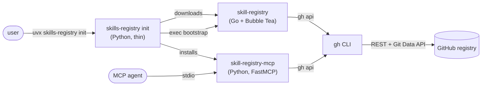
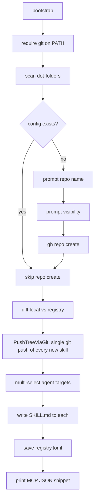

# Skill Registry — architecture deep dive

This document explains how the three pieces (`skills-registry init`, `skill-registry-mcp`, `skill-registry` Go CLI) cooperate, what each component does on the wire, and where to look when something breaks.

---

## 1. Bird's-eye view



Three deliverables, **single repo**, two languages.

| Piece | Language | Distribution | Role |
|---|---|---|---|
| `skills-registry init` | Python | PyPI (`skills-registry`) | Thin bootstrap. Verifies `gh`, installs the MCP server persistently, downloads the Go CLI, then `exec`s it. |
| `skill-registry-mcp` | Python | Same PyPI wheel (entry point) | FastMCP server. Three tools: `list_skills`, `get_skill`, `publish_skill`. |
| `skill-registry` | Go | GitHub Releases (built by `.github/workflows/release.yml`) | TUI manager. `bootstrap`, `list`, `get`, `sync`, `add`, `publish`. |

---

## 2. Bootstrap flow

`uvx skills-registry init` → `skills_mcp/init.py:cmd_init`:

1. `ensure_authed()` — checks `gh auth status`. Exits 3 if missing, 4 if unauthed.
2. `_install_dir()` — defaults to `~/.local/bin` (overridable via `SKILLS_BIN_DIR`).
3. `_download_cli()` — `gh release download` for the right `darwin/linux/windows` + `amd64/arm64` asset. Falls back to `go install` if the user has Go, then bare error with manual steps.
4. `os.execv(binary_path, [binary, "bootstrap", ...flags])` — handover.

The Go binary (`cli/cmd/skill-registry/bootstrap.go:runBootstrap`) does:



Re-running is safe — `~/.config/skills-mcp/registry.toml` short-circuits the repo-create step, and `PushTreeViaGit` skips the commit when the working tree matches the remote.

**Why `git push` for bootstrap?** A first-time user with 30+ skills (≈100+ files) trips GitHub's secondary rate limit at ~80 POSTs/minute when each file is uploaded as a separate `git/blobs` REST call. `PushTreeViaGit` short-circuits that: one `git push` of the whole tree, regardless of file count. Credentials come from `gh auth setup-git` (idempotent — wires `gh` as git's HTTPS credential helper for github.com).

`PushTreeViaGit` requires `git` on PATH; `runBootstrap` fails fast before any prompts when it's missing. The MCP server (`publish_skill`) does **not** use this path — it stays on the REST blob path so it works in the stripped GUI-client environment described in §3.

---

## 3. Why the MCP server avoids `git` (and the CLI bootstrap doesn't)

Desktop MCP clients (Claude Desktop, Cursor, VS Code/Copilot) spawn the MCP server with a stripped environment:

- `PATH` is *not* your shell PATH; `gh` and `git` aren't necessarily reachable.
- `SSH_AUTH_SOCK` is unset, so SSH agent isn't accessible.
- `user.name` / `user.email` may not be configured.
- Credential helpers may not be linked.

So the MCP server's `publish_skill` tool **never** clones, commits, or pushes. It does everything via the Git Data API through `gh api`:

```
GET  repos/{owner}/{repo}/git/ref/heads/{branch}        → parent SHA
GET  repos/{owner}/{repo}/git/commits/{parent}          → base tree SHA
GET  repos/{owner}/{repo}/git/trees/{base}?recursive=1  → list stale files
POST repos/{owner}/{repo}/git/blobs                     → upload each file
POST repos/{owner}/{repo}/git/trees                     → assemble new tree
POST repos/{owner}/{repo}/git/commits                   → create commit
PATCH repos/{owner}/{repo}/git/refs/heads/{branch}      → fast-forward ref
```

If the PATCH returns 409/422 (non-fast-forward), we refetch HEAD and retry up to 3 times with exponential backoff. The implementation lives in `skills_mcp/registry_api.py:RegistryClient.publish_skill` (Python) and is mirrored in `cli/internal/registry/registry.go` (Go) — both clients hit the same endpoints in the same order.

The CLI bootstrap (Go) has stronger guarantees than the MCP server: the user invoked it from an interactive terminal where `git` is virtually always available. So bootstrap uses `registry.Client.PushTreeViaGit`, which `gh auth setup-git`s once, then clones-or-inits a tempdir, writes every file, and does a single `git push`. One network operation regardless of file count; no secondary rate limit. The MCP server can't make those assumptions and stays on the REST blob path.

---

## 4. The cache

`get_skill` writes downloads to `~/.cache/skills-mcp/skills/<slug>/` with a sibling `<slug>.meta.json` recording the registry tree SHA at fetch time. On the next call:

1. `gh api repos/{repo}/contents/` returns the current SHA for `<slug>/`.
2. If it matches the cached meta SHA, we return the cached path immediately.
3. Otherwise the folder is wiped and re-downloaded, then the meta is rewritten.

This is keyed on **tree SHA**, not ETag or `Last-Modified`, so a force-push or any subtree change invalidates correctly.

---

## 5. Configuration resolution

| Source | Wins | Notes |
|---|---|---|
| `SKILLS_REGISTRY=owner/repo[@branch]` env | First | Per-process override. `@branch` is optional; defaults to `main`. |
| `~/.config/skills-mcp/registry.toml` | Second | Written by `init`. Hand-editable. |
| (none) | Boot error | The MCP server exits 2 with an actionable message. |

The TOML is intentionally minimal:

```toml
[registry]
repo = "alice/skill-registry"
default_branch = "main"
```

Python parsing uses `tomllib` on 3.11+ and a tiny hand-rolled fallback on 3.10. The Go CLI does the same thing (no TOML dep).

---

## 6. The `skill-registry/SKILL.md` doc

`cli/internal/bootstrap/skillmd.go:SkillMd` produces a markdown file with frontmatter:

```yaml
---
name: skill-registry
description: |
  Broker to your GitHub-hosted personal skill library at {repo} via the
  `skill-registry` CLI. ...
---
```

…and a CLI-only body documenting `skill-registry list`, `skill-registry get`, and the publish commands. It's written into `<dot-dir>/skills/skill-registry/SKILL.md` for every agent target the user selects during bootstrap.

This template is deliberately Go-only: the only consumer that needs it is the bootstrap flow (which is Go), so there's no Python copy to keep in sync.

---

## 7. Where the dot-folder catalogue lives

| File | Purpose |
|---|---|
| `cli/internal/agents/agents.go` | The full list of 50+ known AI tool dot-folders + display names + universal flag. **Single source of truth.** |
| `cli/internal/scan/scan.go` | Walks `<HOME>/<dot>/skills/**/SKILL.md` and `<cwd>/<dot>/skills/**/SKILL.md`. |
| `cli/cmd/skill-registry/bootstrap.go:dotDirsFromAgents` | Builds the scanner's input from the catalogue. |

The Python side does not carry this catalogue; it lives only in the Go CLI.

---

## 8. Where things can fail (and what to look at)

| Symptom | Suspect |
|---|---|
| `init` exits 3 | `gh` not on `PATH` or fallback list. Install from cli.github.com. |
| `init` exits 4 | `gh auth status` failed. Run `gh auth login`. |
| `init` exits 5 | Couldn't fetch the Go binary. Download manually from the releases page and drop into `~/.local/bin/skill-registry`. |
| `bootstrap` fails with `git not found on PATH` | Install git (macOS: `brew install git`; Linux: `apt install git` / `dnf install git`; Windows: https://git-scm.com/downloads). |
| `bootstrap` push fails with `secondary rate limit` | Should not happen on the `PushTreeViaGit` path. If you see it, you're likely on an older binary that still used REST blob POSTs — re-run `skills-registry init` to pull the latest Go CLI. |
| `publish_skill` keeps returning conflicts | Another publish (CLI? MCP?) is racing. Retry budget is 3; if you see this repeatedly something is fanning out updates. |
| MCP server boot fails with `No registry configured` | `~/.config/skills-mcp/registry.toml` missing and no `SKILLS_REGISTRY` env. Run `skills-registry init` or set the env. |
| MCP server boot fails with `gh not found` in a GUI client | The fallback list missed the install location. Symlink `gh` into `~/.local/bin` or set the install dir to one of the fallback paths. |
| Cache never invalidates | Check `~/.cache/skills-mcp/skills/<slug>.meta.json` — its `tree_sha` must equal the GitHub-reported folder SHA. |

---

## 9. Future-proofing notes

- **Multiple registries**: today config is single-registry. A `connect <owner/repo>` CLI command + a `[registries]` array in the TOML would let an agent see several registries side-by-side; not implemented yet.
- **Browsing public registries** without making your own is a natural follow-up — the read tools (`list_skills`, `get_skill`) don't require write access.
- **`remove` / `update`** commands are deliberately deferred. They're easy to add (`Publish` already handles deletes via stale-file detection).
- **PR-based contribution flow** to upstream registries: would slot in as `skill-registry contribute <owner/repo> <slug>` and lean on `gh api` for the fork+PR dance.

---

## 10. Reading guide

If you want to understand the system, read in this order:

1. `src/skills_mcp/registry_api.py` — the contract with GitHub.
2. `src/skills_mcp/registry_server.py` — how the contract is exposed as MCP tools.
3. `cli/internal/registry/registry.go` — the Go mirror; same contract.
4. `cli/cmd/skill-registry/bootstrap.go` — the orchestration that ties everything together at first run.

Each file is intentionally small and self-contained.
