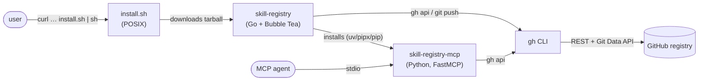
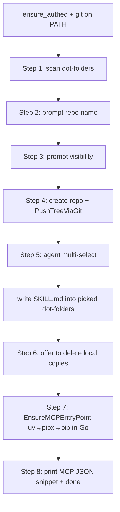
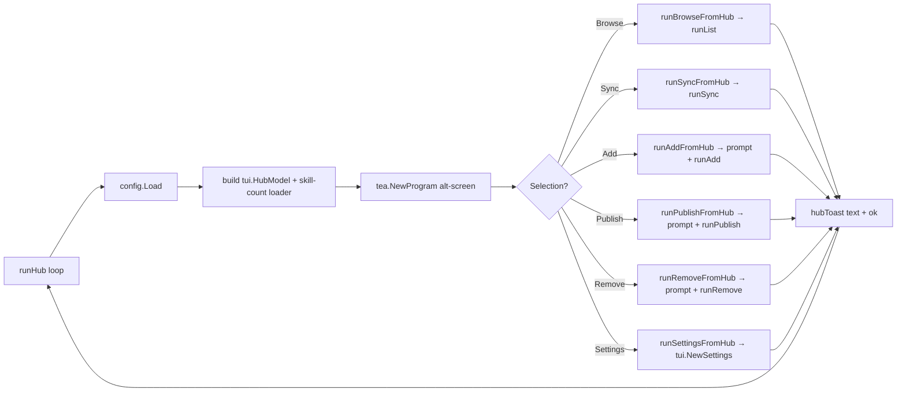

# Skill Registry — architecture deep dive

This document explains how the two pieces (`install.sh` + `skill-registry` Go CLI, and `skill-registry-mcp` Python MCP server) cooperate, what each component does on the wire, and where to look when something breaks.

---

## 1. Bird's-eye view



Two user-facing deliverables, **single repo**, two languages.

| Piece | Language | Distribution | Role |
|---|---|---|---|
| `install.sh` | POSIX sh | Raw GitHub Content (`curl \| sh`) | One-shot installer. Detects OS/arch, downloads the matching Go tarball from the latest release, drops the binary into `~/.local/bin/skill-registry`. |
| `skill-registry` | Go | GitHub Releases (`darwin/linux/windows × amd64/arm64`, built by `.github/workflows/release.yml`) | Everything the user touches: routing (wizard / hub / help), TUI, and headless subcommands (`bootstrap`, `list`, `get`, `sync`, `add`, `publish`, `remove`). Every subcommand honors `--json`. |
| `skill-registry-mcp` | Python | PyPI (auto-installed by the wizard via `uv tool install` → `pipx install` → `pip install --user`) | FastMCP server. Three tools: `list_skills`, `get_skill`, `publish_skill`. |

---

## 2. Install + first-run

The user-facing entry point is now a single shell command:

```
curl -fsSL https://raw.githubusercontent.com/anand-92/skills-registry/main/install.sh | sh
```

`install.sh` (POSIX `sh`, ~150 LOC):

1. Detect OS via `uname -s`, arch via `uname -m`. Map to `darwin/linux × amd64/arm64`. Unsupported tuples exit 2 with a clear message — never silently wrong-asset.
2. Build the release URL (`SKILLS_REGISTRY_VERSION=latest` by default, pinnable to `v0.5.1` etc.).
3. Download via `curl -fsSL` (fall back to `wget`).
4. `tar -xzf` into a `mktemp -d` tempdir, atomically move the binary into `~/.local/bin/skill-registry` (overridable via `SKILLS_BIN_DIR`).
5. Warn if the install dir isn't on `PATH`.

The Python `skills-registry init` script that previously orchestrated this is deprecated — it still exists in the wheel for backwards compatibility, but the canonical install flow no longer touches Python during onboarding.

### 2.1 Bare-command routing (`skill-registry`, no subcommand)

`cli/cmd/skill-registry/main.go:bareRouteDecision` is the single decision function for `skill-registry` invoked with no subcommand. It's pure (no I/O), unit-tested, and produces one of four routes:

| isTTY | --json | config load err | → route | what fires |
|---|---|---|---|---|
| any | `true` | any | `bareRouteHelp` | print usage; exit 0 |
| `false` | `false` | any | `bareRouteHelp` | print usage; exit 0 |
| `true` | `false` | `ErrMissing` (wrapped via `errors.Is` too) | `bareRouteWizard` | first-run onboarding |
| `true` | `false` | nil | `bareRouteHub` | dashboard hub |
| `true` | `false` | other | `bareRouteError` | surface the parse error |

The point: bare `skill-registry` should always land somewhere safe. Non-TTY → no Bubble Tea. `--json` → no Bubble Tea. Otherwise route based on config presence.

### 2.2 First-run wizard

`cli/cmd/skill-registry/wizard.go:runWizard` is an alt-screen Bubble Tea program that owns the full 8-step bootstrap flow:



All four legacy headless-bootstrap concerns (repo create, push, agent install, cleanup) live inside the wizard now. Re-running is safe — the wizard reuses an existing `~/.config/skills-mcp/registry.toml` and short-circuits the repo-create step. The legacy `skill-registry bootstrap` subcommand still exists for scripted use; the wizard is just the interactive face of the same primitives.

**Why `git push` for bootstrap?** A first-time user with 30+ skills (≈100+ files) trips GitHub's secondary rate limit at ~80 POSTs/minute when each file is uploaded as a separate `git/blobs` REST call. `PushTreeViaGit` short-circuits that: one `git push` of the whole tree, regardless of file count. Credentials come from `gh auth setup-git` (idempotent — wires `gh` as git's HTTPS credential helper for github.com).

`PushTreeViaGit` requires `git` on PATH; the wizard fails fast before rendering any screen when it's missing. The MCP server (`publish_skill`) does **not** use this path — it stays on the REST blob path so it works in the stripped GUI-client environment described in §3.

### 2.3 Returning-user hub

`cli/cmd/skill-registry/hub.go:runHub` is the loop a bare `skill-registry` enters once config exists:



Each per-action helper returns a `hubToast`. The next loop iteration seeds that toast into the freshly-built `tui.HubModel` so the user sees "✓ added from owner/repo" / "✗ remove: slug not found" / etc. Per-action errors land as red toasts and the user can retry; only a launcher-level failure (e.g. `config.Load` started failing mid-session) escapes the loop. The hub terminates on quit (`q` / `esc` / `ctrl+c`) or empty selection.

### 2.4 MCP entry-point install (Go)

`cli/internal/bootstrap/mcp_install.go:EnsureMCPEntryPoint` is the Go port of the Python `_ensure_mcp_entry_point`. The wizard calls it during step 7; standalone `bootstrap` callers can rely on the same function. Logic:

1. Honor `SKILLS_SKIP_INSTALL=1` — early return.
2. Probe the curated fallback dirs (`~/.local/bin`, `~/.local/share/uv/tools/skills-registry/bin`, `/opt/homebrew/bin`, `/usr/local/bin`) for `skill-registry-mcp`. If present → early return.
3. Iterate installers in order:
   - `uv tool install --force skills-registry`
   - `pipx install --force skills-registry`
   - `python3 -m pip install --user --upgrade skills-registry`
   `uv` / `pipx` are skipped when their binary isn't on PATH; `pip` is always attempted last.
4. First exit-0 + on-disk presence wins. Total failure prints a manual-install hint to stderr but **never aborts** — the bootstrap flow continues and the printed MCP JSON snippet just references a binary the user has to install themselves.

This decouples installer plumbing from the host package manager: Linux users without `uv` or `pipx` still get the entry point via `pip --user`, and the Go binary never assumes a specific Python ecosystem layout.

---

## 3. Why the MCP server avoids `git` (and the CLI bootstrap doesn't)

Desktop MCP clients (Claude Desktop, Cursor, VS Code/Copilot) spawn the MCP server with a stripped environment:

- `PATH` is *not* your shell PATH; `gh` and `git` aren't necessarily reachable.
- `SSH_AUTH_SOCK` is unset, so SSH agent isn't accessible.
- `user.name` / `user.email` may not be configured.
- Credential helpers may not be linked.

So the MCP server's `publish_skill` tool **never** clones, commits, or pushes. It does everything via the Git Data API through `gh api`:

```
GET  repos/{owner}/{repo}/git/ref/heads/{branch}        → parent SHA
GET  repos/{owner}/{repo}/git/commits/{parent}          → base tree SHA
GET  repos/{owner}/{repo}/git/trees/{base}?recursive=1  → list stale files
POST repos/{owner}/{repo}/git/blobs                     → upload each file
POST repos/{owner}/{repo}/git/trees                     → assemble new tree
POST repos/{owner}/{repo}/git/commits                   → create commit
PATCH repos/{owner}/{repo}/git/refs/heads/{branch}      → fast-forward ref
```

If the PATCH returns 409/422 (non-fast-forward), we refetch HEAD and retry up to 3 times with exponential backoff. The implementation lives in `skills_mcp/registry_api.py:RegistryClient.publish_skill` (Python) and is mirrored in `cli/internal/registry/registry.go` (Go) — both clients hit the same endpoints in the same order.

The CLI bootstrap (Go) has stronger guarantees than the MCP server: the user invoked it from an interactive terminal where `git` is virtually always available. So bootstrap uses `registry.Client.PushTreeViaGit`, which `gh auth setup-git`s once, then clones-or-inits a tempdir, writes every file, and does a single `git push`. One network operation regardless of file count; no secondary rate limit. The MCP server can't make those assumptions and stays on the REST blob path.

### 3.1 The `remove` API sequence

`Client.Delete` (Go) and the analogous Python `delete_skill` use **the same six-call sequence** as `publish_skill`, but build a tree that drops every file under `<slug>/`:

```
GET  repos/{owner}/{repo}/git/ref/heads/{branch}        → parent SHA
GET  repos/{owner}/{repo}/git/commits/{parent}          → base tree SHA
GET  repos/{owner}/{repo}/git/trees/{base}?recursive=1  → enumerate paths under <slug>/
POST repos/{owner}/{repo}/git/trees                     → base_tree + {path: <slug>/x, sha: null} entries
POST repos/{owner}/{repo}/git/commits                   → "remove: <slug>" pointing at the new tree
PATCH repos/{owner}/{repo}/git/refs/heads/{branch}      → fast-forward ref
```

Setting `sha: null` on a tree entry is GitHub's idiomatic "delete this path" — a single atomic commit removes the entire subtree without ever materializing a working copy locally. Same 409/422 retry budget as `Publish`. If the recursive-tree call returns no entries under `<slug>/`, the function exits with `ErrSlugNotFound` (the `remove` CLI surfaces this as a clean exit-1 with a non-destructive message; nothing on the registry side runs).

The CLI's `runRemove` then layers two non-registry cleanup steps on top of `Delete`:

1. **Cache wipe** — `~/.cache/skills-mcp/skills/<slug>/` and the sibling `<slug>.meta.json` are removed if present (so the next `get_skill` re-fetches a fresh copy of whatever slug the user might re-create later under the same name).
2. **Dot-folder sweep** — every known agent dot-folder (`~/.claude/skills`, `~/.factory/skills`, `.agents/skills`, …) is scanned for a direct child whose name (or `Slugify`'d name — the hyphen-vs-underscore case) matches the slug; matches are `os.RemoveAll`'d (unlinks symlinks, recursively removes real dirs).

The result is a single command that leaves no trace of the slug across the registry + cache + every agent the user has wired up. JSON callers get a `{"removed_from": [...]}` array indicating which of those three locations actually had anything to delete.

---

## 4. The cache

`get_skill` writes downloads to `~/.cache/skills-mcp/skills/<slug>/` with a sibling `<slug>.meta.json` recording the registry tree SHA at fetch time. On the next call:

1. `gh api repos/{repo}/contents/` returns the current SHA for `<slug>/`.
2. If it matches the cached meta SHA, we return the cached path immediately.
3. Otherwise the folder is wiped and re-downloaded, then the meta is rewritten.

This is keyed on **tree SHA**, not ETag or `Last-Modified`, so a force-push or any subtree change invalidates correctly.

---

## 5. Configuration resolution

| Source | Wins | Notes |
|---|---|---|
| `SKILLS_REGISTRY=owner/repo[@branch]` env | First | Per-process override. `@branch` is optional; defaults to `main`. |
| `~/.config/skills-mcp/registry.toml` | Second | Written by `init`. Hand-editable. |
| (none) | Boot error | The MCP server exits 2 with an actionable message. |

The TOML is intentionally minimal:

```toml
[registry]
repo = "alice/skill-registry"
default_branch = "main"
```

Python parsing uses `tomllib` on 3.11+ and a tiny hand-rolled fallback on 3.10. The Go CLI does the same thing (no TOML dep).

---

## 6. The `skill-registry/SKILL.md` doc

`cli/internal/bootstrap/skillmd.go:SkillMd` produces a markdown file with frontmatter:

```yaml
---
name: skill-registry
description: |
  Broker to your GitHub-hosted personal skill library at {repo} via the
  `skill-registry` CLI. ...
```

…and a CLI-only body documenting:

1. **Install hint** — the `curl -fsSL …/install.sh | sh` one-liner agents can rerun if the binary disappears off PATH.
2. **`list` / `get`** — discover + fetch.
3. **`publish` / `add` / `sync`** — write paths.
4. **`remove`** — atomic deletion across registry + cache + dot-folders.
5. **`--json` table** — payload shape for every subcommand, so the agent can drive the CLI programmatically without scraping source.

It's written into `<dot-dir>/skills/skill-registry/SKILL.md` for every agent target the user selects during bootstrap.

This template is deliberately Go-only: the only consumer that needs it is the bootstrap flow (which is Go), so there's no Python copy to keep in sync.

---

## 7. Where the dot-folder catalogue lives

| File | Purpose |
|---|---|
| `cli/internal/agents/agents.go` | The full list of 50+ known AI tool dot-folders + display names + universal flag. **Single source of truth.** |
| `cli/internal/scan/scan.go` | Walks `<HOME>/<dot>/skills/**/SKILL.md` and `<cwd>/<dot>/skills/**/SKILL.md`. |
| `cli/cmd/skill-registry/bootstrap.go:dotDirsFromAgents` | Builds the scanner's input from the catalogue. |

The Python side does not carry this catalogue; it lives only in the Go CLI.

---

## 8. Where things can fail (and what to look at)

| Symptom | Suspect |
|---|---|
| `install.sh` exits 2 | Unsupported OS/arch. Download manually from the releases page and drop a binary into `~/.local/bin/skill-registry`. |
| `install.sh` "binary not found inside downloaded archive" | The release asset is malformed or the URL was pinned to a non-existent tag. Verify `SKILLS_REGISTRY_VERSION` or unset it to use `latest`. |
| Wizard fails before the first prompt with `gh not found` | `gh` not on `PATH` or fallback list. Install from cli.github.com. |
| Wizard fails before the first prompt with `gh not authenticated` | Run `gh auth login`. |
| Wizard fails with `git not found on PATH` | Install git (macOS: `brew install git`; Linux: `apt install git` / `dnf install git`; Windows: https://git-scm.com/downloads). |
| Wizard push fails with `secondary rate limit` | Should not happen on the `PushTreeViaGit` path. If you see it, your binary may predate F1.1 — re-run `install.sh` to pick up the latest release. |
| `publish_skill` / `remove` keeps returning 409 conflicts | Another writer is racing. Retry budget is 3; if you see this repeatedly something is fanning out updates. |
| `remove` exits 1 with "slug not found in registry" | Expected when the slug isn't on GitHub. No destructive action runs. Check `skill-registry list --json \| jq '.[].slug'` for the canonical name. |
| MCP server boot fails with `No registry configured` | `~/.config/skills-mcp/registry.toml` missing and no `SKILLS_REGISTRY` env. Run `skill-registry` to launch the wizard, or set the env directly. |
| MCP server boot fails with `gh not found` in a GUI client | The fallback list missed the install location. Symlink `gh` into `~/.local/bin` or set the install dir to one of the fallback paths. |
| Cache never invalidates | Check `~/.cache/skills-mcp/skills/<slug>.meta.json` — its `tree_sha` must equal the GitHub-reported folder SHA. |

---

## 9. Future-proofing notes

- **Multiple registries**: today config is single-registry. A `connect <owner/repo>` CLI command + a `[registries]` array in the TOML would let an agent see several registries side-by-side; not implemented yet.
- **Browsing public registries** without making your own is a natural follow-up — the read tools (`list_skills`, `get_skill`) don't require write access.
- **`update`** would round out the destructive surface. `remove` shipped in F4.1; an explicit `update` would surface "what changed" diffs that today's "publish from a folder" path doesn't.
- **Windows installer.** `install.sh` is POSIX-only. A `install.ps1` (and `gh.exe` lookup in `FindGH`) would close the gap for Windows users.
- **PR-based contribution flow** to upstream registries: would slot in as `skill-registry contribute <owner/repo> <slug>` and lean on `gh api` for the fork+PR dance.
- **Deprecating the Python `init` script.** Now that `install.sh` + the Go wizard own the bootstrap flow end-to-end, the legacy `skills-registry init` console script is dead weight for new users. Dropping it would let us also drop the `[project.scripts] skills-registry` entry; the wheel would then host only `skill-registry-mcp`.

---

## 10. Reading guide

If you want to understand the system, read in this order:

1. `src/skills_mcp/registry_api.py` — the contract with GitHub (Publish + Get + List).
2. `src/skills_mcp/registry_server.py` — how the contract is exposed as MCP tools.
3. `cli/internal/registry/registry.go` — the Go mirror; same contract + `Delete` + `PushTreeViaGit`.
4. `cli/cmd/skill-registry/main.go` — bare-command routing (`bareRouteDecision`) into the wizard / hub / help.
5. `cli/cmd/skill-registry/wizard.go` — the alt-screen onboarding flow that wires it all together at first run.
6. `cli/cmd/skill-registry/hub.go` — the dashboard loop returning users land in.
7. `cli/internal/bootstrap/mcp_install.go` — the Go-side `uv` → `pipx` → `pip` installer for `skill-registry-mcp`.
8. `cli/internal/jsonout/jsonout.go` — the persistent `--json` flag plumbing every subcommand branches on.

Each file is intentionally small and self-contained.
