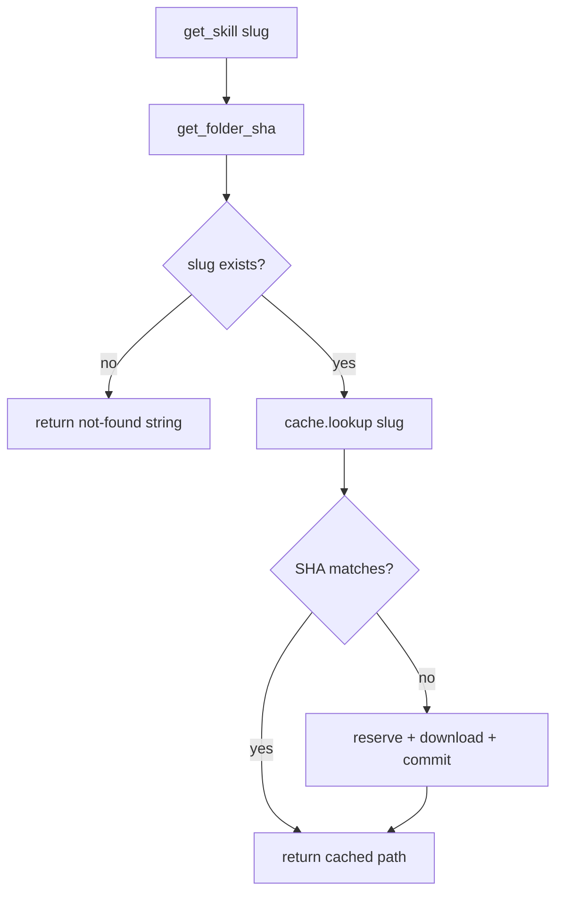
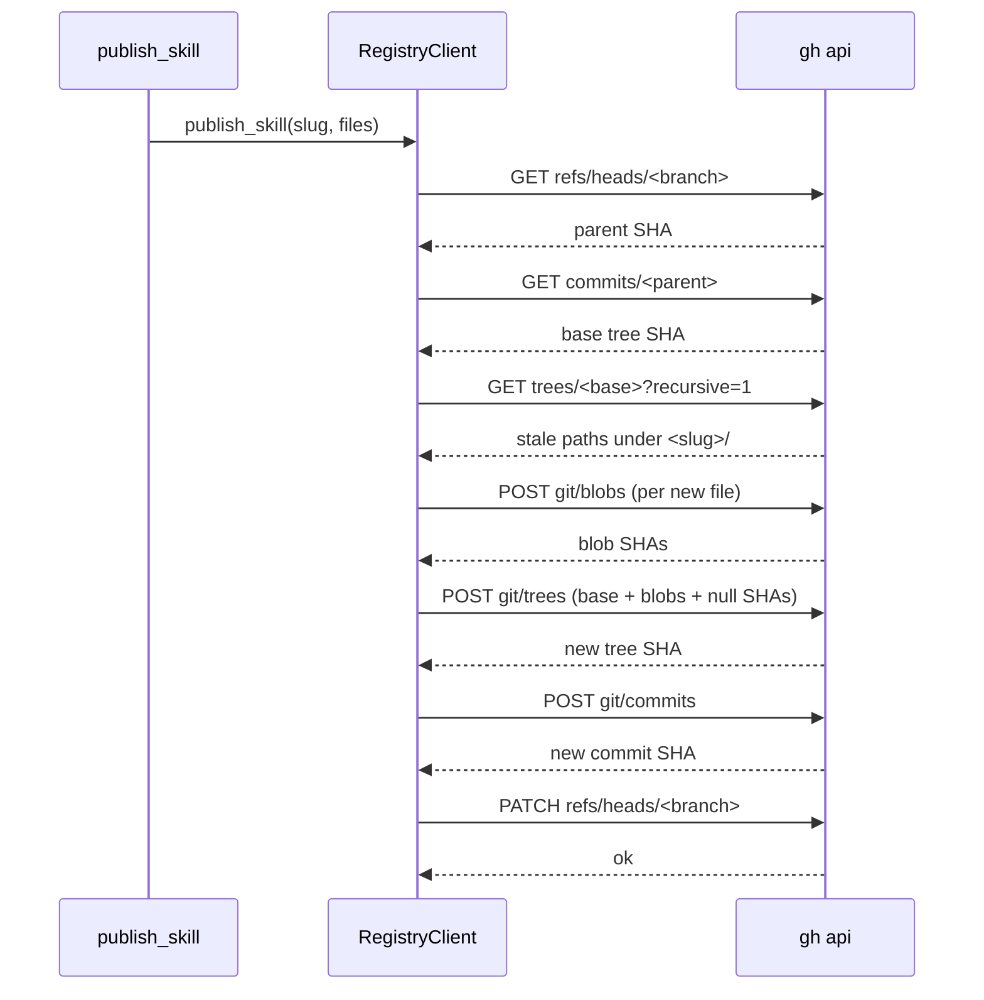

# MCP tools

Active contributors: Nik Anand

## What this page covers

`skills-registry-mcp` is a FastMCP stdio server that registers three tools against the user's GitHub-backed registry repo. All three are defined inline in `src/skills_mcp/registry_server.py:_register_tools` and built on top of `RegistryClient` from `src/skills_mcp/registry_api.py`. Read this page for the contract — signatures, return shapes, annotations, error cases — and cross to [../systems/registry-client.md](../systems/registry-client.md) for the implementation walkthrough of the publish sequence and retry behavior.

The server is constructed as `FastMCP("skills-registry", instructions=..., version=__version__)` inside `build_server()`. Boot validation runs config load → `gh` lookup → `gh auth status`; see [../apps/mcp-server.md](../apps/mcp-server.md) for the exit-code mapping.

## Annotation profiles

Each tool ships an `annotations={...}` dict that clients use to gate UI:

- `readOnlyHint: True` → call without confirmation; idempotent.
- `destructiveHint: True` → prompt for explicit approval; surface "this will change something" copy.
- `openWorldHint: True` → reaches outside the sandbox; show a network-touch indicator.

| Tool | `readOnlyHint` | `destructiveHint` | `openWorldHint` |
| --- | --- | --- | --- |
| `list_skills` | ✓ | — | ✓ |
| `get_skill` | ✓ | — | ✓ |
| `publish_skill` | — | ✓ | ✓ |

All three carry `tags={"skills", "registry"}` for client-side filtering.

## `list_skills`

```python
@server.tool(
    name="list_skills",
    description="List every skill in the user's GitHub skill registry…",
    tags={"skills", "registry"},
    annotations={"readOnlyHint": True, "openWorldHint": True},
)
def list_skills() -> str: ...
```

No arguments. Returns a single markdown string laid out as:

```
Registry: `owner/repo` (N skills)

| slug | name | description |
| --- | --- | --- |
| `auth-skill` | Auth skill | Validates JWT signatures against your KMS. |
| `csv-export` | CSV export | Streams query results to CSV with backpressure. |

Use `get_skill(slug="<slug>")` to download a skill. …
```

The description column escapes pipes (`|` → `\|`) and collapses newlines so the rendered table stays well-formed. Empty registries return the literal string `"No skills found in {repo}."`.

**Implementation.** `RegistryClient.list_skills()` calls `GET /repos/{repo}/contents/`, filters dotfiles and the skip-list (`node_modules`, `__pycache__`), then per surviving folder fetches `SKILL.md` and parses frontmatter for `name` + `description`. Sorted by slug. Each row is a `SkillSummary(slug, name, description, path, tree_sha)` — see [../primitives/skill.md](../primitives/skill.md).

**Errors.** Network errors from `gh api` surface as MCP errors. A 404 on the contents listing returns an empty list, rendered as `"No skills found in …"` — no protocol-level distinction between "empty" and "missing", by design.

## `get_skill`

```python
@server.tool(
    name="get_skill",
    description="Download a single skill from the registry into a local cache folder…",
    tags={"skills", "registry"},
    annotations={"readOnlyHint": True, "openWorldHint": True},
)
def get_skill(slug: str) -> str: ...
```

Takes one positional argument: `slug` (the registry slug, e.g. `"auth-skill"`). The argument is normalized via `slugify(slug)` so an agent calling with the display name still resolves correctly.

Returns the absolute local filesystem path (as a string) to the cached skill folder. The folder contains `SKILL.md` at its root plus any supporting files the skill ships (`scripts/`, `assets/`, `resources/`). **The agent's contract is: read `SKILL.md` first, then follow its instructions for which supporting files to load.** Loading every file unconditionally would waste tokens — skill authors structure SKILL.md as a dispatcher.

A missing slug returns the literal string `"Skill 'foo' not found in {repo}."` so a downstream model can recover gracefully without parsing an MCP error envelope.

**Cache flow.** The tool's behaviour is a two-state decision driven by GitHub's tree SHA for `<slug>/`. The Python module that owns this is `src/skills_mcp/cache.py`; full discussion at [../systems/caching.md](../systems/caching.md).



The cache lives at `~/.cache/skills-mcp/skills/<slug>/` with a sibling `<slug>.meta.json` recording the tree SHA at download time. Force-pushes and any folder edit invalidate correctly because the GitHub tree SHA changes.

**Side effects.** Disk writes under `~/.cache/skills-mcp/`. No registry writes.

## `publish_skill`

```python
@server.tool(
    name="publish_skill",
    description="Publish a skill to the registry…",
    tags={"skills", "registry"},
    annotations={"destructiveHint": True, "openWorldHint": True},
)
def publish_skill(
    name: str,
    files: dict[str, str] | None = None,
    local_folder: str | None = None,
) -> str: ...
```

Takes a required `name` (display name, used to derive the slug via `slugify(name)`) plus exactly one of:

- `files: dict[str, str]` — a mapping of path-relative-to-skill-folder → UTF-8 text content. Example: `{"SKILL.md": "...", "resources/example.md": "..."}`.
- `local_folder: str` — an absolute path to a folder containing `SKILL.md`. The folder is walked recursively; hidden entries (`.git`, `.DS_Store`) and `__pycache__` are skipped.

Passing both or neither raises `ValueError`. The payload must include a top-level `SKILL.md`. Files exceeding the `SKILLS_MAX_FILE_BYTES` cap (default 2 MiB) are rejected with a `ValueError` listing the offending path.

Returns a single-line status string:

```
Published `auth-skill` to owner/repo@abc1234. View: https://github.com/owner/repo/tree/abc1234/auth-skill
```

**Atomic publish sequence.** The actual write is the six-call Git Data API dance in `RegistryClient._publish_once`. Each step is the smallest atomic operation we can make atomic against concurrent writers:



Conflict resolution: a 409 or 422 on the PATCH triggers a refetch of HEAD and a retry. Up to 3 attempts, exponential backoff (`0.5s`, `1.0s`, `2.0s`). After the budget is exhausted, the tool raises `RegistryConflictError` and the MCP runtime surfaces it as a tool error to the agent. See [../systems/registry-client.md](../systems/registry-client.md) for the full retry semantics and how the Go side mirrors it.

**Side effects.** Replaces the entire `<slug>/` subtree atomically. Other top-level skills are untouched (the new tree is built `base_tree`-on-top-of the old one). Files under `<slug>/` not present in the new payload are removed via null-SHA tree entries — publishing is a folder reset, not a merge.

**Hardening.** `_normalize_rel_path` rejects `..` segments (including backslash-encoded), iterated `./` prefixes, and absolute-path injection. Mirrored on the Go side. See [../apps/mcp-server.md](../apps/mcp-server.md) for the line-by-line walkthrough.

## Cross-references

- [../apps/mcp-server.md](../apps/mcp-server.md) — boot-time validation, exit codes, logging, FastMCP construction.
- [../systems/registry-client.md](../systems/registry-client.md) — implementation of the six-call publish + retry budget + slug-delete path.
- [../systems/caching.md](../systems/caching.md) — tree-SHA-keyed cache that backs `get_skill`.
- [../primitives/skill.md](../primitives/skill.md) — slugify rules, `SkillSummary` shape, frontmatter contract.
- [../overview/architecture.md](../overview/architecture.md) — how MCP tools relate to the CLI subcommands.
