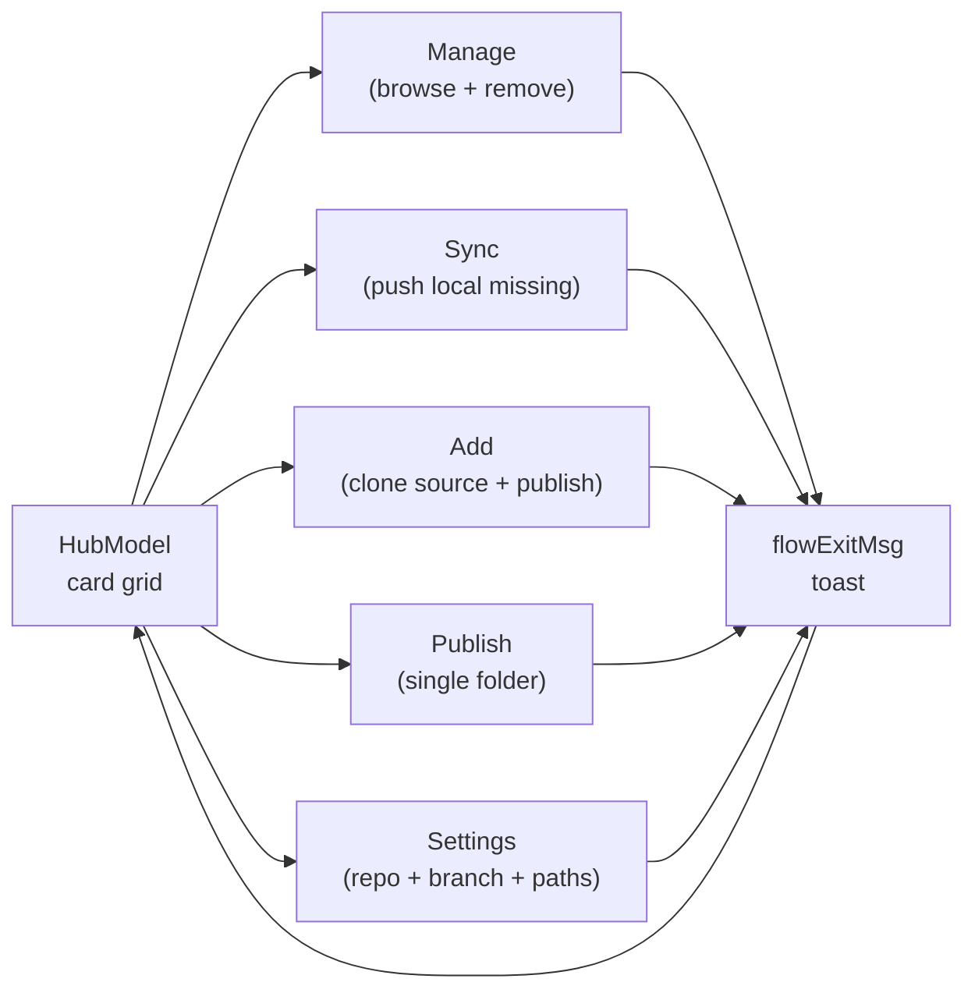

# Wizard and hub

Active contributors: Nik Anand

## What they do

`skills-registry` invoked with no subcommand routes the user into one of two alt-screen Bubble Tea programs. The wizard handles first-run onboarding when no config exists. The hub is the returning-user dashboard. Both render in alt-screen mode so the terminal scrollback stays clean; both exit back to the prompt when the user picks Quit (`q` / `esc` / `ctrl+c`).

`cli/cmd/skills-registry/main.go:bareRouteDecision` picks between them based on `isTTY × --json × config load error`. See [apps/cli/index](index.md#bare-command-routing) for the truth table.

## Wizard

`cli/cmd/skills-registry/wizard.go:runWizard` is the launcher. It calls `registry.EnsureAuthed(gh)` and `requireGitForBootstrap()` up front so a missing `gh` auth or missing `git` aborts before the user clicks through any prompts, then constructs `tui.NewWizard(ctx).WithDeps(deps)` and runs the program inside `tea.WithAltScreen()`.

### The 8 steps

| # | Step | What runs | Source |
| --- | --- | --- | --- |
| 1 | Scan dot-folders | `scan.Discover` over `agents.All()`'s dot-folder list | `cli/internal/scan/scan.go` |
| 2 | Prompt repo name | Single textinput with `skills-registry` as the default | `cli/internal/tui/wizard.go` |
| 3 | Prompt visibility | Choice between `private` (recommended) and `public` | `cli/internal/tui/wizard.go` |
| 4 | Create repo + push | `gh repo create` then `registry.Client.PushTreeViaGit` (single `git push`) | `cli/cmd/skills-registry/wizard.go:wizardPushSkills` |
| 5 | Multi-select agents | Fuzzy multi-select over `agents.All()`; universal targets locked | `cli/internal/tui/multiselect.go` |
| 6 | Offer cleanup | `scan.EntriesForCleanup` + Choice prompt to delete local copies | `cli/cmd/skills-registry/wizard.go:wizardLoadCleanup` |
| 7 | Install MCP entry point | `bootstrap.EnsureMCPEntryPoint` — `uv tool install` → `pipx install` → `pip install --user` | `cli/internal/bootstrap/mcp_install.go` |
| 8 | Print MCP JSON snippet | `bootstrap.MCPJSONSnippet(bin)` with the resolved absolute binary path | `cli/internal/bootstrap/skillmd.go` |

`WizardStep` is an enum in `cli/internal/tui/wizard.go`; each value has a `Title()` used in the step indicator and panel header.

### The WizardDeps callback pattern

The wizard model never touches the network or filesystem directly. Every side effect goes through a callback on `tui.WizardDeps`:

```go
type WizardDeps struct {
    Scan          func(ctx context.Context) ([]scan.Skill, error)
    CreateRepo    func(ctx context.Context, name, visibility string) (string, error)
    SaveConfig    func(repo string) error
    Push          func(ctx context.Context, repo string, skills []scan.Skill,
                       onProgress func(done, total int),
                       onStatus func(msg string)) (int, error)
    AgentChoices  func() []WizardAgent
    InstallAgents func(ctx context.Context, repo string, picked []any) ([]string, error)
    LoadCleanup   func(ctx context.Context, repo string, skills []scan.Skill) []WizardCleanupEntry
    DeleteCleanup func(entries []WizardCleanupEntry) (deleted, failed int)
    EnsureMCP     func(ctx context.Context) error
    MCPSnippet    func() (snippet, bin string)
}
```

`buildWizardDeps(gh)` in `cli/cmd/skills-registry/wizard.go` wires every closure to its real implementation. The model only knows the shape; tests inject fakes and exercise the state machine without touching `gh`, `git`, or the filesystem. A `nil` callback is treated as a no-op so the unit tests don't need to stub every dep.

After the program exits, `finishWizard` reads `Completed()` and `Cancelled()` from the post-quit model. Cancelled runs print "Onboarding cancelled." and exit `0`. Completed runs print a one-line success caption (`"✓ onboarding complete — your registry <repo> is live."`) and exit `0`.

## Hub

`cli/cmd/skills-registry/hub.go:runHub` launches the dashboard. It loads config, builds a `tui.HubProgram` with the registry repo + a count loader + every flow's dependencies, and runs the program inside `tea.WithAltScreen()`. Unlike the F2 hub design (which used a launch loop with toast threading), F3 collapses everything into one long-lived alt-screen program so the terminal never drops back to scrollback between actions.

### The five cards

`tui.DefaultHubCards()` returns the tiles the dashboard ships with:



| Card | ID | Action |
| --- | --- | --- |
| Manage skills | `HubActionManage` | Animated dual-pane list (`tui.NewList`). Enter downloads; `d` removes after confirmation. |
| Sync | `HubActionSync` | Run sync flow inline — local skills missing from the registry. |
| Add | `HubActionAdd` | Clone an external source, multi-select skills, publish. |
| Publish | `HubActionPublish` | Pick a local folder, publish it as one skill. |
| Settings | `HubActionSettings` | Inspect or edit repo + branch; show read-only cache and MCP paths. |

The deprecated `HubActionBrowse` / `HubActionRemove` constants remain in the enum so older tests still compile; the default grid emits only the five above. Manage absorbs both browse and remove.

### Flow dispatch

`HubProgram.Update` watches for `hubLaunchMsg{action}` from the card grid. On launch it constructs the matching flow model via `newFlow(action)` (e.g. `NewList`, `NewSyncFlow`, `NewSettings`) and stores it in `m.flow`. While `m.flow` is non-nil, `Update` routes messages to the flow and `View` renders the flow.

When the flow finishes, it emits `flowExitMsg{toast, ok}` via `flowExitCmd(...)`. `HubProgram.exitFlow` clears `m.flow`, resets the card grid's selection, and threads the toast text into the next hub frame via `HubModel.WithToast(text, ok)`. A success toast (`ok=true`) renders in the green style; a failure toast (`ok=false`) renders red.

### Settings sub-TUI

`cli/internal/tui/settings.go:SettingsModel` is a small alt-screen sub-program with two editable text inputs (repo, default branch) and two read-only diagnostic lines (cache root, MCP binary path). Repo and branch are the only writable values in `registry.toml`; cache and MCP paths are derived at runtime so they're shown for diagnostics only.

The model focus ring is two fields (`settingsFieldRepo`, `settingsFieldBranch`). Pressing `enter` on a focused field enters edit mode; `esc` reverts to the pre-edit value. `s` saves through the injected `SettingsSaver` closure, which wraps `config.Save`. A save failure surfaces inline with the error message and the user can retry; a successful save updates the `origRepo`/`origBranch` baseline so subsequent `esc` reverts target the new state.

## Key source files

| File | Role |
| --- | --- |
| `cli/cmd/skills-registry/wizard.go` | `runWizard`, `buildWizardDeps`, step callbacks. |
| `cli/cmd/skills-registry/hub.go` | `runHub`, `hubCountLoader`, `errToast`. |
| `cli/cmd/skills-registry/hub_flow_deps.go` | `buildHubDeps` — wires every card to its real implementation. |
| `cli/internal/tui/wizard.go` | `WizardModel`, `WizardDeps`, `WizardStep` enum. |
| `cli/internal/tui/hub.go` | `HubModel`, `HubCard`, `DefaultHubCards()`. |
| `cli/internal/tui/hub_program.go` | `HubProgram` — orchestrates hub + flow models in one alt-screen run. |
| `cli/internal/tui/settings.go` | `SettingsModel` — repo/branch editor + diagnostics. |
| `cli/internal/tui/multiselect.go` | Shared fuzzy multi-select used by the agent picker and sync/add flows. |
| `cli/internal/tui/listmodel.go` | Animated dual-pane list used by `list` and the Manage card. |

## Cross-references

- [apps/cli/index](index.md) — Cobra root, `--json`, version injection.
- [apps/cli/subcommands](subcommands.md) — the headless surface every card delegates to.
- [overview/architecture](../../overview/architecture.md) — how the wizard and hub fit into the full pipeline.
- [systems/registry-client](../../systems/registry-client.md) — the `registry.Client` callbacks the wizard and hub invoke.
- [systems/bootstrap-push](../../systems/bootstrap-push.md) — `PushTreeViaGit`, the step-4 mechanism.
