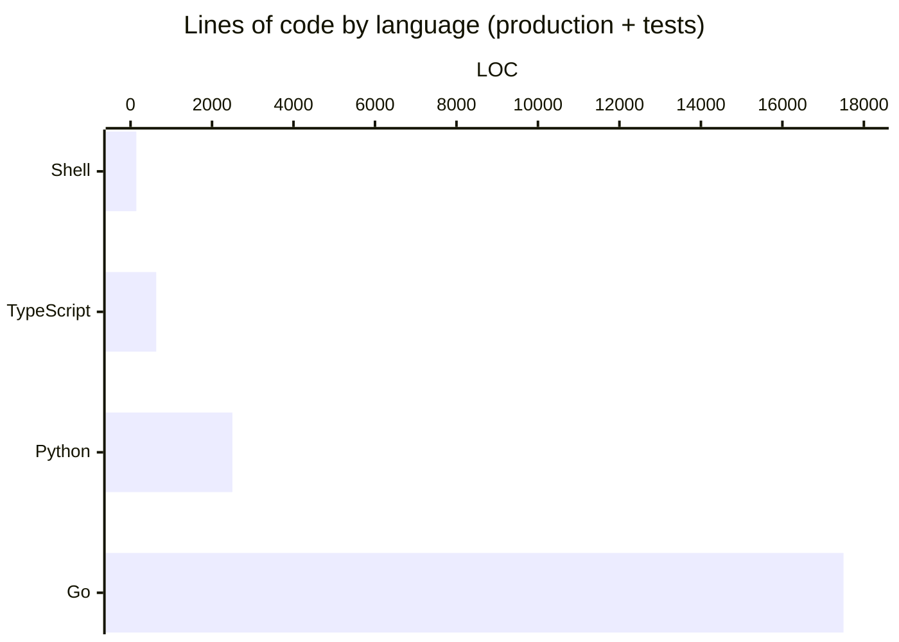

# By the numbers

Data collected on 2026-05-24. The repo is three days old, so every "lifetime" metric below is also a "this week" metric.

## Size

The codebase is overwhelmingly Go, with a small Python MCP server and a thin marketing site on top.

A finer split:

| Language | Production LOC | Tests LOC | Notes |
|---|---:|---:|---|
| Go (`cli/`) | ~7,000 | ~10,500 | Cobra CLI + Bubble Tea TUI + registry client |
| Python (`src/skills_mcp/`) | ~600 | ~1,900 | FastMCP server, registry client, helpers |
| TypeScript (`website/`) | ~631 | 0 | Next.js 16 / React 19 single-page site |
| Shell (`install.sh`) | 142 | 0 | POSIX installer |

Total: roughly **20,196 LOC** of Go + Python combined, plus the website and the installer.

Module / package count:

| Surface | Count |
|---|---:|
| Go packages under `cli/internal/` | 10 (`agents`, `bootstrap`, `cache`, `config`, `jsonout`, `registry`, `scan`, `tui`, plus subcommand dir and root cmd) |
| Python modules in `src/skills_mcp/` | 8 (`__init__`, `__main__`, `init`, `registry_server`, `registry_api`, `gh`, `config`, `cache`, `frontmatter`) |
| Go subcommands under `cli/cmd/skills-registry/` | 7 (`bootstrap`, `list`, `get`, `sync`, `add`, `publish`, `remove`) plus root + wizard + hub |
| FastMCP tools registered | 3 (`list_skills`, `get_skill`, `publish_skill`) |

## Activity

The commit timeline is lopsided. The pivot day swallowed everything.

| Date | Commits | Note |
|---|---:|---|
| 2026-05-21 | 16 | Initial release as `skills-mcp` (consolidate-local-skills model) |
| 2026-05-22 | 1 | Single fix to gather (tolerate per-skill copy failures) |
| 2026-05-23 | 82 | The pivot — registry model, Go CLI, FastMCP server, wizard, hub, install.sh, website |
| 2026-05-24 | 4 | PR review fixes from gemini-code-assist and factory-droid bots |
| **Total** | **103** | |

Recent churn is effectively the whole repo. Every file in the table below was either created or substantially rewritten in the last 72 hours.

| File | LOC | Why it's big |
|---|---:|---|
| `cli/internal/tui/wizard.go` | 1518 | 8-step Bubble Tea state machine |
| `cli/internal/registry/registry.go` | 1289 | Git Data API client, atomic publish/delete, `PushTreeViaGit` |
| `cli/internal/tui/listmodel.go` | 1236 | Browse / sync / publish / remove list views |
| `cli/internal/registry/registry_test.go` | 930 | `gh`-shim driven scenarios |
| `cli/internal/tui/wizard_test.go` | 924 | Per-step wizard transitions |
| `cli/internal/tui/wizard_steps.go` | 785 | Step handlers extracted from `wizard.go` |
| `cli/cmd/skills-registry/bootstrap.go` | 718 | Headless bootstrap subcommand |
| `cli/cmd/skills-registry/json_test.go` | 618 | `--json` matrix across every subcommand |

## Bot-attributed commits

The git log carries an explicit AI footprint:

- **1 commit** with author `droid` — `feat(install): add curl|sh installer for the Go binary`. The user-facing entry point of the project.
- **7 commits** with author-line attribution to `factory-droid[bot]` or `gemini-code-assist[bot]` review suggestions.
- **2 commits** with `Co-authored-by:` trailers crediting an AI assistant.

This is a **lower bound**. Inline tools (Copilot, Cursor tab-complete, IDE autocomplete) leave no trace in the log, so the actual AI contribution rate is unknowable from `git log` alone. Treat the 10 attributed commits as the floor, not the ceiling.

## Complexity

CI gates complexity strictly:

| Tool | Scope | Ceiling |
|---|---|---:|
| ruff `C90` (mccabe) | Python | 12 |
| `gocyclo` (excluding `_test`) | Go | 15 |
| `staticcheck` | Go | unused symbols, correctness |
| `deadcode -test` | Go | reachability |

Lint state across the repo:

- **0** TODO, FIXME, or HACK comments in production code.
- **0** ESLint suppressions on the website (`/* eslint-disable */` count: 0).
- **0** `staticcheck` or `deadcode` findings on `main`.

One deliberate complexity-avoidance choice shows up twice: the project parses YAML frontmatter without taking on PyYAML or go-yaml as a full YAML parser. `src/skills_mcp/frontmatter.py` and the Go-side equivalent in `cli/internal/scan/scan.go` both hand-roll a "YAML-ish" parser that handles flat `key: value` pairs and nothing else. Multi-line values, lists, and nested keys are silently dropped. The trade is intentional: a hard cap on what frontmatter can express keeps every skill file trivially parseable from either language, and keeps the mandatory Python runtime dependency list at exactly one entry (`fastmcp`).

Test counts:

- **139** Python tests under `tests/` (pytest + pytest-cov).
- Go tests across all 10 internal packages plus the root command. The two largest test files alone hold ~1,900 lines.
