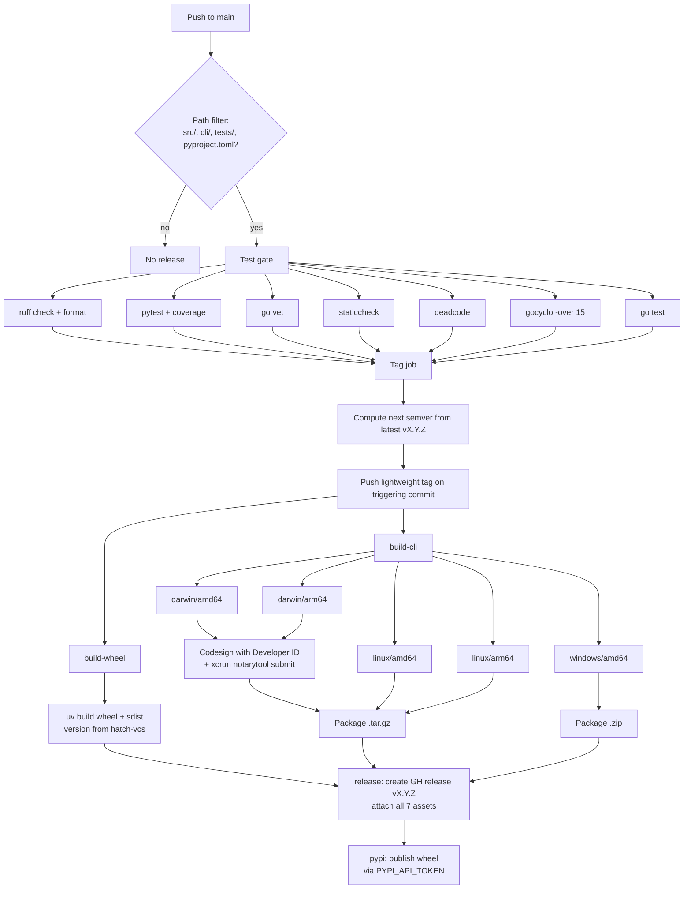

# Deployment

Active contributors: Nik Anand

`skills-registry` auto-releases on every push to `main` that touches the runtime. The pipeline lives in `/Users/dks0662779/skillsmcp/.github/workflows/release.yml`. Doc-only and workflow-only commits do not release.

## Path filter

The workflow's `on.push.paths` allows-list is the release decision:

- `src/**` — Python MCP server.
- `cli/**` — Go CLI.
- `tests/**` — Python test suite.
- `pyproject.toml` — Python project metadata (deps, build, scripts).

A push that touches anything else (docs, workflow files, the website, `README.md`) does not trigger a release. This is intentional: the wiki, contributor guide, and marketing surface change independently of shipped artifacts.

## Pipeline



## Stages

### 1. Test gate

Identical to the CI workflow's quality checks. Both must pass cleanly:

- `uv run ruff check .`
- `uv run ruff format --check .`
- `uv run pytest -v --cov=skills_mcp`
- `(cd cli && go vet ./...)`
- `(cd cli && staticcheck ./...)` — versions pinned via the `go install` command in CI.
- `(cd cli && deadcode -test ./...)`
- `(cd cli && gocyclo -over 15 -ignore "_test" .)`
- `(cd cli && go test ./...)`

The test gate inside `release.yml` is a near-duplicate of `ci.yml`. If you change one, change the other. There is no shared composite action yet.

### 2. Tag job

Computes the next version by looking at the latest `vX.Y.Z` tag in the repo:

- Default bump is **patch**.
- `workflow_dispatch` input `bump=minor` or `bump=major` overrides.

The job pushes a lightweight tag on the **triggering commit**. There is no version commit on `main`; the version is whatever hatch-vcs reads from the tag at build time. This avoids the loop where a release commit triggers another release.

Force a non-patch bump:

```bash
gh workflow run release.yml -f bump=minor
gh workflow run release.yml -f bump=major
```

### 3. build-wheel

`uv build` produces `dist/skills_registry-X.Y.Z-py3-none-any.whl` and `dist/skills_registry-X.Y.Z.tar.gz`. Version comes from `hatch-vcs` reading the freshly-pushed tag. There is no manual `__version__` literal; `src/skills_mcp/__init__.py` resolves `__version__` from the installed package metadata.

### 4. build-cli (matrix)

Five targets, built in parallel:

| GOOS | GOARCH | Artifact |
| --- | --- | --- |
| darwin | amd64 | `skills-registry_darwin_amd64.tar.gz` |
| darwin | arm64 | `skills-registry_darwin_arm64.tar.gz` |
| linux | amd64 | `skills-registry_linux_amd64.tar.gz` |
| linux | arm64 | `skills-registry_linux_arm64.tar.gz` |
| windows | amd64 | `skills-registry_windows_amd64.zip` |

Build command:

```bash
go build -trimpath -ldflags "-s -w -X main.version=${version}" \
  -o skills-registry ./cmd/skills-registry
```

`-trimpath` strips build-time absolute paths from the binary. `-s -w` strips the symbol table and DWARF debug info. `-X main.version=${version}` stamps the version reported by `skills-registry --version`.

**macOS only:** both darwin binaries are codesigned with the Developer ID certificate (`apple-actions/import-codesign-certs@v3`) and notarized via `xcrun notarytool submit ... --wait` before being packaged. Without this Gatekeeper will block first launch from a `curl | sh` install on user machines.

### 5. release

Creates (or updates, if re-running) the GitHub release for the freshly-pushed tag. Attaches the seven assets:

- 1 wheel
- 1 sdist
- 4 `.tar.gz` (darwin amd64/arm64, linux amd64/arm64)
- 1 `.zip` (windows amd64)

`install.sh` always resolves the binary URL as `https://github.com/{owner}/{repo}/releases/latest/download/skills-registry_{os}_{arch}.tar.gz` (with `SKILLS_REGISTRY_VERSION` overriding the `latest` segment), so the moment this release is published the installer points at it.

### 6. pypi

Uploads the wheel to PyPI via the `pypi` GitHub environment using `PYPI_API_TOKEN`. The job is gated on the `pypi` environment so the secret is scoped to release runs only.

The `skills-registry-mcp` console script ships in this wheel. The wizard's MCP-entry-point install (`cli/internal/bootstrap/mcp_install.go:EnsureMCPEntryPoint`) consumes whichever PyPI version `uv tool install skills-registry` / `pipx install skills-registry` / `pip install --user skills-registry` resolves — i.e. the freshly-published one.

## Installer flow

`install.sh` is the user-facing entry point. It is POSIX `sh` and:

1. Detects OS and arch via `uname -s` / `uname -m`. Overridable with `SKILLS_REGISTRY_OS` / `SKILLS_REGISTRY_ARCH`.
2. Resolves the tarball URL. Default: `https://github.com/anand-92/skills-registry/releases/latest/download/skills-registry_{os}_{arch}.tar.gz`. Override with `SKILLS_REGISTRY_URL`, or supply a local tarball via `SKILLS_REGISTRY_TARBALL`.
3. Downloads, extracts, and drops the binary at `${SKILLS_BIN_DIR:-~/.local/bin}/skills-registry`.
4. If `SKILLS_REGISTRY_DRY_RUN` is set, prints the resolved URL/dest and exits without writing anything.

The installer does not touch the Python wheel — that lives on PyPI and the Go wizard installs it in the background on first run.

## Gaps

- No Python version matrix yet (we build against the resolver's choice).
- No OS matrix for the Python test job.
- No Dependabot.
- No codecov upload (coverage XML is generated but not pushed).
- No integration tests that actually call GitHub. All `gh api` interactions in tests go through a Python shim that replays scripted JSON.
- The test gate inside `release.yml` duplicates `ci.yml`. Touching one without the other is a common mistake; reviewers should catch it.

There is no Windows installer counterpart to `install.sh`. The Go binary builds for `windows/amd64` and ships in every release, but Windows users currently have to download and unzip it manually. A PowerShell `install.ps1` is on the known-limitations list.
