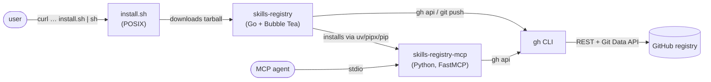
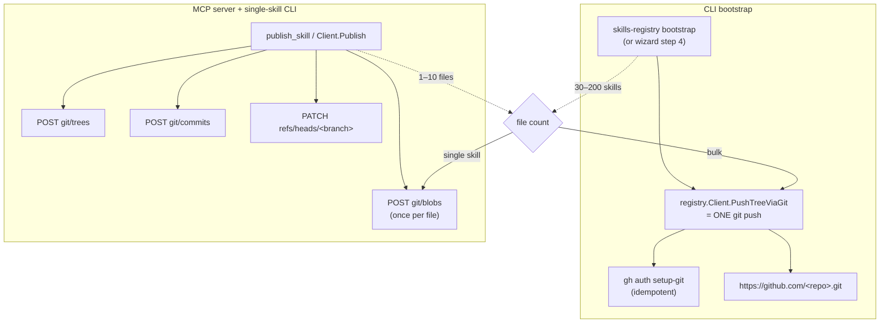
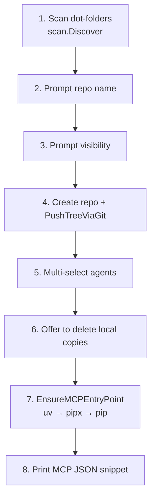
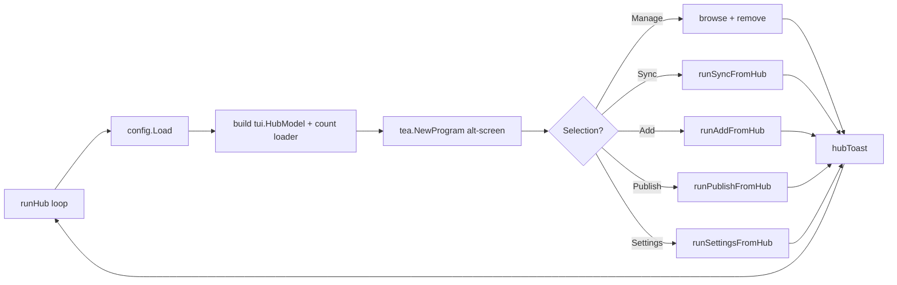

# Architecture

`skills-registry` is one repository that produces three deliverables. The interesting thing is how they cooperate: the Go binary owns every interactive surface, the Python server owns the MCP transport, and both speak to GitHub through the same authenticated `gh` CLI but along two deliberately different network paths.

## Bird's-eye view



The user never sees Python during onboarding. `install.sh` drops the Go binary into `~/.local/bin/skills-registry`, the bare invocation routes into the wizard (no config) or the hub (config present), and the wizard installs the Python MCP server in the background via `uv` → `pipx` → `pip`.

## Two upload paths, one repository

A single skill is 1–10 files; a first-time bootstrap is 30–200 skills (100–500 files). The choice of "how do we send files to GitHub" depends on the file count. The CLI bootstrap and the MCP server pick different paths for the same operation:



- **MCP server (Python) and single-skill `publish`** go through the **Git Data API** via `gh api`. Six calls per publish, retries on 409/422. Lives in `src/skills_mcp/registry_api.py` and is mirrored in `cli/internal/registry/registry.go`.
- **CLI bootstrap (Go)** uses a single **`git push`** over HTTPS authenticated by `gh auth setup-git`. One network operation regardless of file count. Lives in `cli/internal/registry/registry.go:PushTreeViaGit`.

Why the split? GitHub enforces a secondary rate limit (~80 POSTs/minute) on the Git Data API blob endpoint. A first-time user with 100+ files trips it. A single skill publish never does. The MCP server can't use `git push` because desktop MCP clients spawn the server with a stripped environment (no shell `PATH`, no `SSH_AUTH_SOCK`, no `git config user.email`).

See [systems/registry-client](../systems/registry-client.md) and [systems/bootstrap-push](../systems/bootstrap-push.md).

## Bare-command routing

When a user types `skills-registry` with no subcommand, `cli/cmd/skills-registry/main.go:bareRouteDecision` decides where they land. It is a pure function — no I/O — so the routing matrix is unit-testable end to end.

| isTTY | `--json` | config load error | → route |
| --- | --- | --- | --- |
| any | `true` | any | `bareRouteHelp` (print usage; exit 0) |
| `false` | `false` | any | `bareRouteHelp` |
| `true` | `false` | `ErrMissing` | `bareRouteWizard` |
| `true` | `false` | `nil` | `bareRouteHub` |
| `true` | `false` | other | `bareRouteError` (surface malformed config) |

Bare invocation always lands somewhere safe. Non-TTY → no Bubble Tea. `--json` → no Bubble Tea. Otherwise route based on whether config exists.

## First-run wizard (8 steps)

`runWizard` (`cli/cmd/skills-registry/wizard.go`) owns the full onboarding flow inside an alt-screen Bubble Tea program:



Each step is wired to a callback in `tui.WizardDeps`; the model never touches the network or filesystem directly. See [apps/cli/wizard-and-hub](../apps/cli/wizard-and-hub.md).

## Dashboard hub (returning users)



The hub is a launch loop. Each iteration: build the model, run the alt-screen program, read `Selection()` from the post-quit model, dispatch the matching helper, capture the result as a toast, seed the toast into the next iteration. Quit on `q` / `esc` / `ctrl+c`. See [apps/cli/wizard-and-hub](../apps/cli/wizard-and-hub.md).

## Module-level layout

```
install.sh                  # POSIX installer — the user-facing entry point
src/skills_mcp/             # Python MCP server + legacy init shim
  registry_server.py        # FastMCP with 3 tools
  registry_api.py           # RegistryClient (gh-api wrapper)
  gh.py                     # find_gh + ensure_authed + gh_api
  config.py                 # ~/.config/skills-mcp/registry.toml
  cache.py                  # ~/.cache/skills-mcp/skills/<slug>/
  frontmatter.py            # YAML-ish parser
  init.py                   # legacy bootstrap shim
cli/                        # Go module (own go.mod)
  cmd/skills-registry/       # cobra root + subcommand handlers
  internal/
    agents/                 # 56-entry dot-folder catalogue
    bootstrap/              # SKILL.md template + MCP entry-point installer
    cache/                  # mirrors src/skills_mcp/cache.py path resolution
    config/                 # mirrors src/skills_mcp/config.py
    jsonout/                # persistent --json flag plumbing
    registry/               # mirrors registry_api.py + Delete + PushTreeViaGit
    scan/                   # local skill discovery
    tui/                    # Bubble Tea models (hub, wizard, list, settings, …)
tests/                      # Python pytest suite (focused, gh stubbed)
docs/registry.md            # architecture deep dive (user-facing)
website/                    # Next.js marketing site
.github/workflows/          # CI (lint + test) + release (auto-tag + GH release + PyPI)
```

## What's deliberately not in here

- **No PyYAML.** The frontmatter parser is hand-rolled in both languages. Skills authors have one runtime dependency (`fastmcp`) on the Python side; the Go side carries cobra + bubbletea + lipgloss + yaml.v3 (used only for parsing — not as a MCP-facing dep). See [background/design-decisions](../background/design-decisions.md).
- **No SSH.** Every GitHub call goes through `gh`'s HTTPS path. The MCP server cannot rely on `SSH_AUTH_SOCK` being set.
- **No embedded HTTP client.** The MCP server shells out to `gh api`. The Go bootstrap shells out to `gh` and `git`. Auth always routes through the user's already-authenticated `gh`.
- **No multi-registry support yet.** Config is one repo. A `[registries]` array is listed as a future improvement in [background/design-decisions](../background/design-decisions.md).

## Read in this order

If you want to understand the system end to end:

1. `src/skills_mcp/registry_api.py` — the contract with GitHub (Publish + Get + List).
2. `src/skills_mcp/registry_server.py` — how the contract is exposed as MCP tools.
3. `cli/internal/registry/registry.go` — the Go mirror, plus `Delete` + `PushTreeViaGit`.
4. `cli/cmd/skills-registry/main.go` — `bareRouteDecision`.
5. `cli/cmd/skills-registry/wizard.go` — alt-screen onboarding.
6. `cli/cmd/skills-registry/hub.go` — dashboard loop.
7. `cli/internal/bootstrap/mcp_install.go` — Go-side `uv` → `pipx` → `pip` installer.
8. `cli/internal/jsonout/jsonout.go` — persistent `--json` flag plumbing.

Each file is intentionally small and self-contained.
