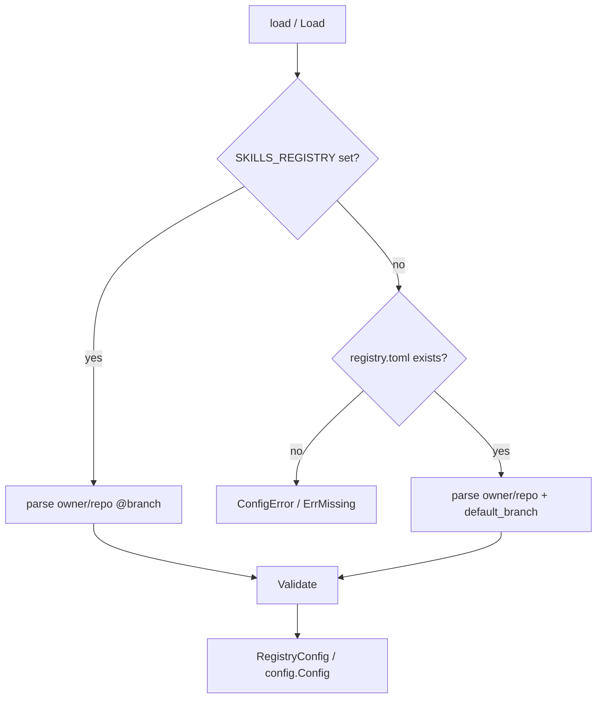

# Registry config

Active contributors: Nik Anand

## What it is

The registry config is the resolved identity of the GitHub repo a `skills-registry` install is connected to. Two fields, no more: the `owner/repo` slug, and the default branch. Every entrypoint on both the Python and Go sides calls `load()` / `Load()` as its first real action; failure to resolve a config is an early, loud, actionable error.

| Language | Type | File |
| --- | --- | --- |
| Python | `RegistryConfig(repo, default_branch)` (frozen `@dataclass`) | `src/skills_mcp/config.py` |
| Go | `config.Config{Repo, DefaultBranch}` (plain struct) | `cli/internal/config/config.go` |

The Go side additionally exposes `Owner()` and `Name()` accessors that split `Repo` on the first `/` so callers (the wizard step that creates the repo, the URL builder in `publish.go`) don't have to repeat the split logic.

## Resolution order

The two implementations resolve identically:



1. **`SKILLS_REGISTRY` environment variable** — if set and non-empty, wins unconditionally. The format is `owner/repo` with an optional `@branch` suffix (e.g. `SKILLS_REGISTRY=anand-92/my-skills@main`). The branch defaults to `main` when omitted. Useful for CI, ephemeral overrides, or pointing one shell session at a fork without touching the on-disk config.
2. **`~/.config/skills-mcp/registry.toml`** — the persisted config. Written by the wizard once the user picks a repo; readable by `skills-registry-mcp` from then on.
3. **Neither** → Python raises `ConfigError` with actionable text; Go returns the sentinel `ErrMissing`.

The Go `ErrMissing` is wrapped exactly so the bare-command router (`bareRouteDecision` in `cli/cmd/skills-registry/main.go`) can pattern-match on it via `errors.Is`:

```go
case errors.Is(configLoadErr, config.ErrMissing):
    return bareRouteWizard
```

A missing config on a TTY-attached terminal lands the user in the first-run wizard. A malformed config — a TOML parse error, an unreadable file, an invalid `owner/repo` — does **not** trigger the wizard; that takes the `bareRouteError` branch and surfaces the underlying error so the user can fix the file. The wizard is for first runs, not for stomping on broken state.

## The TOML format

```toml
# Auto-generated by `skills-registry bootstrap`. Edit `repo` to point at a different registry.
[registry]
repo = "anand-92/my-skills"
default_branch = "main"
```

One section, two keys. Comments are tolerated; blank lines are tolerated. `default_branch` defaults to `"main"` when missing or empty. The file is written 0644 (no secrets in here) by `Save(cfg)` in both languages.

We hand-roll the TOML parser on both sides to avoid pulling in a runtime dependency for three keys. Python uses stdlib `tomllib` on 3.11+ and a tiny line-by-line parser on 3.10 as a fallback. Go uses a tiny line-by-line parser unconditionally. Both reject anything that doesn't look like `owner/repo` with `validate()`.

## XDG honor

The on-disk path honors `XDG_CONFIG_HOME`:

```python
# src/skills_mcp/config.py
def config_path() -> Path:
    base = os.environ.get("XDG_CONFIG_HOME")
    root = Path(base).expanduser() if base else Path.home() / ".config"
    return root / "skills-mcp" / "registry.toml"
```

```go
// cli/internal/config/config.go
func Path() string {
    if base := os.Getenv("XDG_CONFIG_HOME"); base != "" {
        return filepath.Join(base, "skills-mcp", "registry.toml")
    }
    home, _ := os.UserHomeDir()
    return filepath.Join(home, ".config", "skills-mcp", "registry.toml")
}
```

When `XDG_CONFIG_HOME=/foo`, the config lives at `/foo/skills-mcp/registry.toml`. Without the env var we use the conventional `~/.config/skills-mcp/registry.toml`. The two implementations apply the same rule, so the wizard's `Save` lands at the same path the MCP server's `Load` reads from — even under XDG.

## Validation

`validate(repo)` (Go) and `_validate_repo(repo)` (Python) enforce the `owner/repo` shape:

- Must contain exactly one `/`.
- Neither the owner nor the name portion may be empty.

Anything else raises `ConfigError` (Python) or returns an error (Go). The check fires in both `Load` and `Save`, so a wizard that constructs a bad config can't accidentally write it.

## `Owner()` and `Name()` accessors

The Go side exposes two methods on `config.Config`:

```go
func (c Config) Owner() string {
    if i := strings.Index(c.Repo, "/"); i >= 0 {
        return c.Repo[:i]
    }
    return c.Repo
}

func (c Config) Name() string {
    if i := strings.Index(c.Repo, "/"); i >= 0 {
        return c.Repo[i+1:]
    }
    return c.Repo
}
```

`Owner()` is what `gh repo create` needs as the namespace argument; `Name()` is what the URL builder needs after the slash. The Python side hasn't needed equivalents — the FastMCP server treats `repo` as one opaque string and passes it whole to `gh api`.

## `ErrMissing` — the wizard trigger

`config.ErrMissing` is the single sentinel that the router uses to decide between "this is a first-time user" and "this is a returning user". Returned by `Load()` when:

- The `SKILLS_REGISTRY` env var is unset (or empty after trimming whitespace), **and**
- The on-disk `registry.toml` doesn't exist.

Any other failure path returns a wrapped error — a malformed env value, a malformed TOML file, a permission-denied read — and those land on `bareRouteError`, not the wizard. The wizard is constructive (it writes a new config); a returning user with a broken file should not be silently re-onboarded.

## Used by

Every entrypoint on both sides:

| Caller | Why |
| --- | --- |
| `build_server()` (`src/skills_mcp/registry_server.py`) | First call in the FastMCP server boot. A missing config exits the process with code 2 (`ConfigError`). |
| `bareRouteDecision` (`cli/cmd/skills-registry/main.go`) | Routes the bare invocation between wizard / hub / error based on `ErrMissing` vs other errors. |
| `runHub` (`cli/cmd/skills-registry/hub.go`) | Reloads on every loop iteration so a settings edit takes effect immediately. |
| Every subcommand's `RunE` | First call before constructing `registry.Client`. |
| `runWizard` (`cli/cmd/skills-registry/wizard.go`) | Calls `Save(cfg)` after the user picks a repo + visibility. |

## Key source files

| File | Role |
| --- | --- |
| `src/skills_mcp/config.py` | Python `RegistryConfig` + `load` + `save` + `_parse_toml` + `_parse_toml_minimal`. |
| `cli/internal/config/config.go` | Go `Config` + `Load` + `Save` + `parseTOML` + `parseEnvValue` + `validate` + `ErrMissing`. |

## Cross-references

- [../reference/configuration.md](../reference/configuration.md) — the user-facing reference for the env var and the TOML keys.
- [../overview/architecture.md](../overview/architecture.md) — the bare-command router that pattern-matches on `ErrMissing`.
- [../apps/cli/wizard-and-hub.md](../apps/cli/wizard-and-hub.md) — the wizard that writes the config and the hub that reads it.
- [../apps/mcp-server.md](../apps/mcp-server.md) — `build_server()`'s exit-code mapping for `ConfigError`.
- [skill.md](skill.md) — the other primitive every operation depends on.
