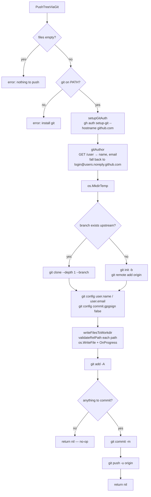

# Bootstrap push

Active contributors: Nik Anand

## What it does

`PushTreeViaGit` is the bulk-import path used by the first-run wizard (and the legacy `bootstrap` subcommand) to seed a brand-new registry with every skill a user already has scattered across their AI tool dot-folders. It shells out to the local `git` binary, materializes every file in a tempdir, and pushes the whole tree to GitHub over HTTPS in one `git push`. Lives in `cli/internal/registry/registry.go`. The function is Go-only — the Python MCP server never carries it, because the wizard runs in the Go binary.

## Why not the REST blob path

The `registry.Client.Publish` path (see [registry-client](registry-client.md)) uploads each file with a separate `POST /repos/{r}/git/blobs` call. GitHub enforces a secondary rate limit on this endpoint at roughly 80 POSTs per minute. A first-time user typically has:

- 30–200 skills.
- 3–5 files per skill (a `SKILL.md` plus supporting scripts, references, or assets).
- 100–500 files in total.

A 200-file publish runs over the limit and the wizard either errors out partway through or sleeps for two minutes. A `git push` is one network operation regardless of file count, so a 500-file initial commit lands as fast as a 5-file one. Once the registry is populated, every subsequent publish is one skill at a time — 1–10 files, well below the rate limit — and goes through the REST path.

The trade-off: `PushTreeViaGit` requires `git` to be installed locally and an authenticated `gh` (so it can wire up an HTTPS credential helper). Both are already prerequisites for the wizard.

## The decision tree



## Auth: `gh auth setup-git`

The first network step is `gh auth setup-git --hostname github.com`. The call is idempotent: it appends a credential-helper line to the user's `~/.gitconfig` for `github.com` pointing at the `gh` binary, and re-running it is a no-op. From that point on, any `git push` over HTTPS to `github.com` asks `gh` to mint a token instead of prompting for a password or looking in the macOS keychain. The token never appears in argv, environment variables, or on disk — `gh` hands it to git through the credential-helper protocol's stdin pipe.

There is no SSH path. We deliberately avoid SSH so the bootstrap works in any environment that has `gh` set up (which the user must already have done to run the wizard).

## Author resolution: `gitAuthor`

The commit needs `user.name` and `user.email`. We pull them from the authenticated GitHub identity:

```
GET /user → {"login": "alice", "name": "Alice Lee", "email": "alice@…"}
```

If `name` is empty (some users keep it private), we fall back to `login`. If `email` is empty (GitHub hides emails by default), we synthesize the no-reply address `<login>@users.noreply.github.com`. This always produces a valid commit author, and it lines up with what `gh` itself does in its `gh repo clone` UX.

We then run `git config user.name`, `git config user.email`, and `git config commit.gpgsign false` inside the tempdir so the user's global `~/.gitconfig` isn't touched and the user's GPG signing setup (if any) doesn't trip up the commit.

## Clone-or-init: `refExists`

A fresh repo created by `gh repo create` (without `--add-readme`) has no commits and no branches. A `git clone` against it fails with "remote HEAD ambiguous". We distinguish the two states by calling `GET /repos/{r}/git/ref/heads/<branch>` first:

- `200` → branch exists → shallow clone (`--depth 1 --branch <branch>`).
- `404` or `409` → branch missing → `git init -b <branch>` and `git remote add origin`.
- Any other status → return the error.

The shallow clone is intentional: even for a 500-file registry we don't need the full history to push an additional commit on top of it. Init-from-empty is the fast path for the first-ever bootstrap.

## Path validation: `validateRelPath`

Every key in the input `files` map is normalized and validated before being written to disk. Rejections:

- Empty strings.
- Absolute paths (`/etc/passwd`).
- Paths containing `..` segments after `filepath.Clean`.
- Windows volume names (`C:\foo`).
- Backslash-encoded traversals.

These match the rejections applied in `_normalize_rel_path` in `registry_api.py`, so a publish that's rejected by the Python MCP server stays rejected if the user tries the same payload through the Go CLI.

## `commitAndPushIfChanged` — the no-op path

After writing files we run `git add -A` followed by `git status --porcelain`. If the porcelain output is empty, the working tree matches the remote and we return without committing. This is the no-op path: re-running the wizard against an already-populated registry doesn't create empty commits.

When there's a real change, the function runs `git commit -m <message>`, calls `OnStatus("pushing to github…")` so the TUI can show progress, and runs `git push -u origin <branch>`. Stdout is discarded; stderr is captured and embedded in any error message so failures surface with the underlying git diagnostics.

## Tempdir lifecycle

The working directory is `os.MkdirTemp("", "skills-registry-push-*")`, and the function defers `os.RemoveAll(work)` immediately. Nothing persists outside the user's `~/.gitconfig` (which now references `gh` as its credential helper for `github.com`). The credential helper line is added by `gh auth setup-git` and we don't try to remove it — it's the same line `gh` would add for any other operation, and removing it would break the next push.

## What `PushTreeViaGit` does NOT do

- It does not delete files. The REST publish path includes null-SHA entries to drop stale blobs; the git-push path only adds or overwrites. The wizard never needs deletions because it's the first push to a brand-new repo.
- It does not retry. The function returns on the first failure. The REST path retries on 409/422; the git-push path is a single push, so a conflict means another writer raced it, and the caller should re-run.
- It does not handle multiple branches. `DefaultBranch` is read once at the top.

## Key source files

| File | Symbol | Role |
| --- | --- | --- |
| `cli/internal/registry/registry.go` | `PushTreeViaGit` | Top-level orchestrator. |
| `cli/internal/registry/registry.go` | `resolveGitBin` | Locates the `git` binary (honors `Client.GitBin` for tests). |
| `cli/internal/registry/registry.go` | `setupGitAuth` | Runs `gh auth setup-git`. |
| `cli/internal/registry/registry.go` | `gitAuthor` | Resolves commit author from `GET /user`. |
| `cli/internal/registry/registry.go` | `refExists` | Probes whether the branch already exists upstream. |
| `cli/internal/registry/registry.go` | `initWorkdir` | Clone-or-init branch decision. |
| `cli/internal/registry/registry.go` | `configureGitRepo` | Sets `user.name`, `user.email`, disables GPG. |
| `cli/internal/registry/registry.go` | `validateRelPath` | Path traversal / absolute / Windows-volume rejection. |
| `cli/internal/registry/registry.go` | `writeFilesToWorkdir` | Materializes files with progress reporting. |
| `cli/internal/registry/registry.go` | `commitAndPushIfChanged` | The `add → status → commit → push` sequence with the no-op short-circuit. |

## Cross-links

- [Registry client](registry-client.md) — the REST path used for everything except the bulk bootstrap.
- [Architecture](../overview/architecture.md) — the two-upload-paths diagram.
- [CLI commands](../api/cli-commands.md) — the `bootstrap` subcommand that exposes this path on the CLI.
